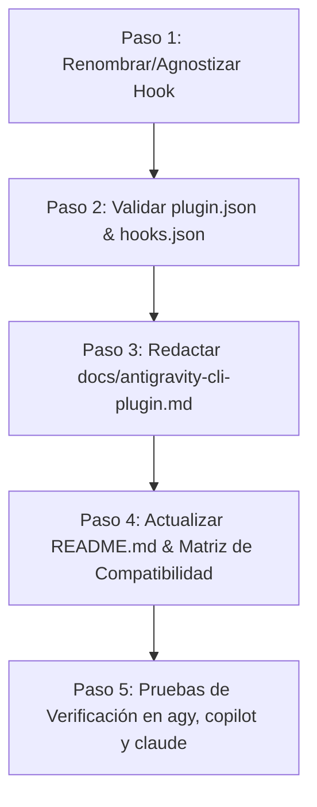

# Plan de Integración de Plugin para Antigravity CLI

> **Objetivo**: Lograr que Specture funcione como un plugin instalable para **Google Antigravity CLI (`agy`)**, manteniendo total compatibilidad y convivencia sin fricciones con **Claude Code** y **GitHub Copilot CLI**.

---

## 1. Diagnóstico de Compatibilidad

Las tres plataformas (Claude Code, Copilot CLI y Antigravity CLI) comparten la misma especificación abierta para:
- **Agent Skills** (`skills/*/SKILL.md` con frontmatter YAML).
- **Control de contexto de subagentes** (`agents/*/AGENT.md`).
- **Eventos Hook de Intercepción** (`PreToolUse`).
- **Estructura estándar de Manifiesto** (`plugin.json`).

Por lo tanto, la arquitectura de Specture permite soporte **triple-nativo** sin duplicación de código ni lógica redundante.

---

## 2. Matriz de Componentes por Plataforma

| Componente | Claude Code | GitHub Copilot CLI | Antigravity CLI (`agy`) | Estrategia de Unificación |
| :--- | :--- | :--- | :--- | :--- |
| **Manifiesto de Plugin** | `.claude-plugin/plugin.json` o `plugin.json` | `.github/plugin/marketplace.json` + `plugin.json` | `plugin.json` en la raíz del plugin | **Un solo `plugin.json` raíz** compatible con los tres esquemas. |
| **Directorio de Skills** | `skills/<nombre>/SKILL.md` | `skills/<nombre>/SKILL.md` | `skills/<nombre>/SKILL.md` | **100% compartido**. Mismo directorio `skills/`. |
| **Directorio de Agentes** | `agents/<agente>/AGENT.md` | `copilot/agents/<agente>.agent.md` | `agents/<agente>/AGENT.md` o `.md` | **Compartido con Claude Code** (`agents/`). Copilot mantiene su subcarpeta `copilot/agents/`. |
| **Hooks / TDD Gate** | `settings.json` (`PreToolUse`) | `hooks.json` (`preToolUse`) | `hooks.json` (`PreToolUse`) | **`hooks.json` unificado** en la raíz ejecutando el wrapper Node.js. |
| **Modo de Invocación** | `/specture:<skill>` | `/agent` (`specture:specture-router`) | `/specture:<skill>` o invocar skill directamente | Soporte unificado de comandos slash `/specture:*`. |

---

## 3. Especificaciones Técnicas

### 3.1. Manifiesto del Plugin (`plugin.json`)
Antigravity CLI reconoce automáticamente el manifiesto en la raíz del plugin:
```json
{
  "name": "specture",
  "description": "Spec-Driven Development framework for AI-assisted software development",
  "version": "1.12.0",
  "author": {
    "name": "Fernando Escobar",
    "email": "keishmen17@gmail.com"
  },
  "homepage": "https://github.com/FerEscobarDev/Specture",
  "repository": "https://github.com/FerEscobarDev/Specture",
  "license": "MIT",
  "keywords": ["sdd", "spec-driven", "tdd", "methodology", "ai-assisted"],
  "agents": "agents/",
  "skills": "skills/",
  "hooks": "hooks.json"
}
```

### 3.2. Instalación en Antigravity CLI
Los usuarios podrán instalar el plugin mediante cualquiera de las siguientes opciones:
1. **Instalación Global vía Git**:
   ```bash
   git clone https://github.com/FerEscobarDev/Specture.git ~/.gemini/config/plugins/specture
   ```
2. **Desarrollo / Enlace Local**:
   ```bash
   agy plugin link ./
   ```

### 3.3. TDD Honesty Gate (Hook Agnóstico)
- `hooks.json` en la raíz registrará el hook de `PreToolUse`.
- El script ejecutable en Node.js actuará de forma agnóstica para Copilot CLI y Antigravity CLI, asegurando la política de fail-safe/fail-open para el bloqueo de commits/writes durante el ciclo TDD.

---

## 4. Plan de Ejecución Paso a Paso



### Detalle de Tareas:

1. **Paso 1: Agnostización del Hook TDD Gate**
   - Adaptar `hooks/copilot-pre-tool-use-tdd-gate.js` a `hooks/specture-tdd-gate.js` (o mantener wrapper sin romper Copilot).
   - Asegurar que el payload de entrada de `PreToolUse` en Antigravity CLI sea procesado correctamente.

2. **Paso 2: Verificación de Manifiestos**
   - Confirmar que `plugin.json` exponga correctamente las claves `skills`, `agents` y `hooks`.

3. **Paso 3: Documentación de Antigravity CLI**
   - Crear el archivo `docs/antigravity-cli-plugin.md` detallando requisitos, comandos de instalación, uso del router (`/specture:start`), y solución de problemas.

4. **Paso 4: Actualización de README.md y Matriz de Compatibilidad**
   - Añadir Antigravity CLI como la 3ra plataforma soportada oficialmente en `README.md`.
   - Actualizar `copilot/compatibility-matrix.json` o crear `compatibility-matrix.json` unificado.

5. **Paso 5: Pruebas y Verificación**
   - Probar la carga del plugin en Antigravity CLI mediante `agy plugin link`.
   - Verificar que los comandos de Copilot y Claude Code sigan funcionando sin cambios ni interrupciones.
