# Diagramas de Flujo de Ejecución — Specture

> Mapa visual de **todos los flujos que el framework ejecuta en tiempo real**: cómo se entra,
> cómo se enruta por estado, cómo cada fase y cada capacidad transversal corre, qué agentes de
> contexto restringido se despachan y qué gates bloquean el avance.

Los diagramas están en **Mermaid** — se renderizan automáticamente en GitHub, VS Code (con la
extensión Mermaid), Obsidian y la mayoría de visores Markdown. Si tu visor no soporta Mermaid,
cada diagrama va acompañado de prosa que describe el flujo.

## Cómo leer estos diagramas (notación)

| Forma | Significado |
|-------|-------------|
| `([texto])` (estadio) | Entrada / salida del flujo (trigger, artefacto, fin) |
| `[texto]` (rectángulo) | Paso de proceso / acción |
| `{texto}` (rombo) | **Gate** o decisión: bloquea el avance hasta resolverse |
| `[[texto]]` (subrutina) | **Enrutamiento** a otro skill (handoff) |
| Línea sólida `-->` | Flujo principal |
| Línea punteada `-.->` | Flujo condicional / de excepción / retorno |
| Etiqueta de arista `-->|"cond"|` | Condición que dispara esa transición |

**Convención de color en SVG:** un solo acento para gates/decisiones, neutro para el resto.

---

## 1. Mapa general

### 1.1 Ciclo de vida — las 5 fases + capacidades transversales

Specture lleva un proyecto **de la idea al código** en 5 fases secuenciales. El router (`start`)
decide en qué fase está el proyecto **mirando el filesystem**, no el historial de chat. Las
capacidades transversales no se enrutan por estado: se activan por **síntoma** durante cualquier fase.

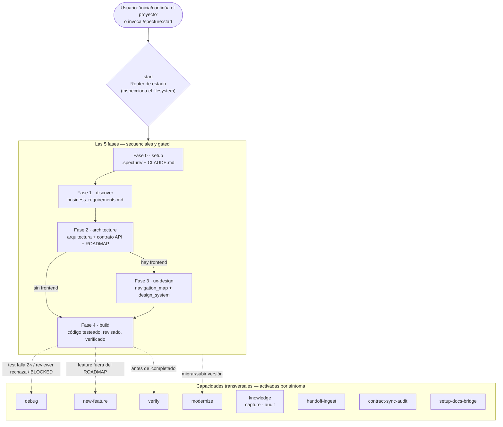

### 1.2 Router de estado (`start`) — máquina de estados

El router corre un chequeo de esquema (Step 0, desde v1.15.0) y cinco chequeos de fase **en
orden**, y se detiene en el primero que falle, enrutando a la fase dueña. **Regla de costo:** nunca
lee archivos completos — usa chequeos de existencia, `grep` de una línea, la lectura de un solo
campo y una llamada al script del doctor. Confía en el filesystem por encima de la memoria.

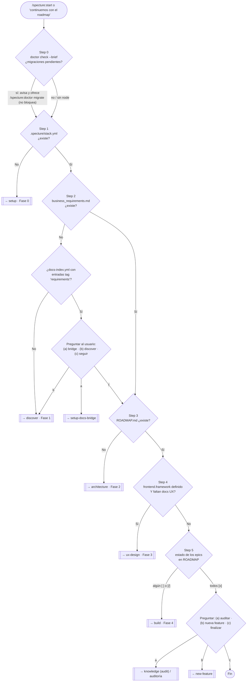

---

## 2. Modelo de agentes de contexto restringido

El corazón de Specture: las fases despachan **agentes funcionales**, cada uno recibe **solo** los
archivos que necesita — nunca la conversación entera, memoria personal ni docs externos (salvo
Context7 en la Dimensión 5 del reviewer, cuando está habilitado). Esto previene el *drift* y la
alucinación acumulada. No hay "agente backend vs frontend por capa": hay **funciones cognitivas**
distintas.

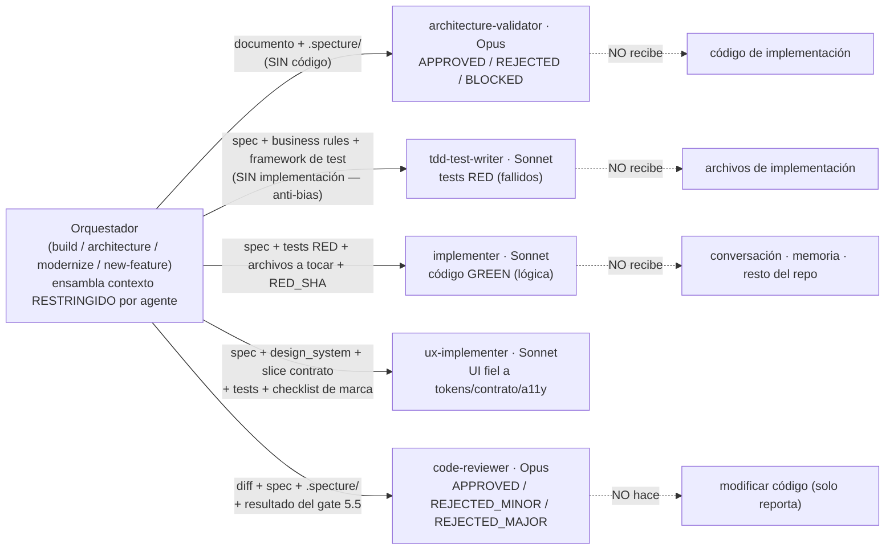

**Verdicts comunes:** `APPROVED` · `REJECTED` / `REJECTED_MINOR` / `REJECTED_MAJOR` ·
`NEEDS_CONTEXT` (falta input → falla barata en turno 1) · `BLOCKED` (no puede avanzar).
Todos los implementadores validan el **Dispatch Manifest** como primera acción (Step 0).

---

## 3. El Build Loop — el núcleo

### 3.1 Modelo coordinador / cola secuencial

Hay **un solo** modo de ejecución. El chat es **solo coordinador**: no genera specs ni corre tests.
Construye una cola de hasta **N** epics y despacha **un epic-agent aislado a la vez**
(concurrencia = 1). El contexto del coordinador se mantiene O(n_epics) — solo checkboxes + reportes.

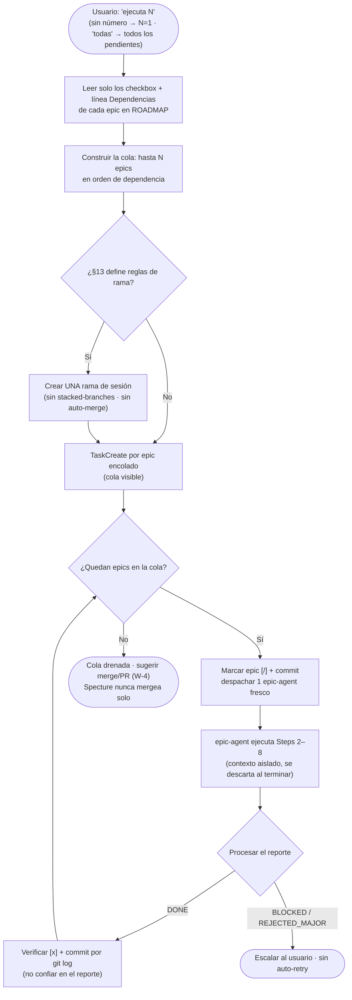

### 3.2 El loop por epic — `spec → validate → RED → GREEN → review → verify`

El diagrama central del framework. Cada epic recorre estos pasos dentro de su epic-agent. Los
**gates** (rombos) son innegociables: validación de arquitectura, RED commit, TDD Honesty Gate,
code review y verificación.

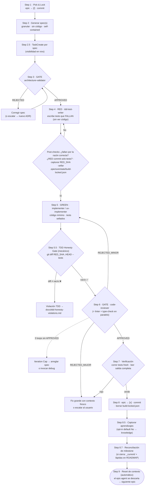

### 3.3 TDD Honesty Gate — secuencia

El contrato de tests se **sella** en el RED commit. El implementer tiene prohibido tocar los tests;
un hook opcional lo bloquea mecánicamente, y el coordinador siempre corre el `git diff` como
defensa en profundidad.

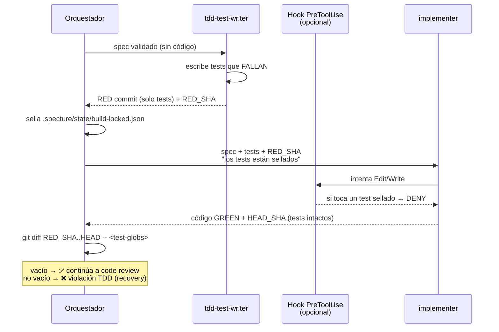

### 3.4 Epics de frontend — Design-System-First + Visual Approval Gate

Para UI, "los tests pasan" nunca significa "se ve bien". La lógica se testea; la **calidad visual la
aprueba un humano**, nunca Claude. El epic de design system se construye primero y pasa por un gate
de aprobación visual antes de que pueda empezar cualquier página.

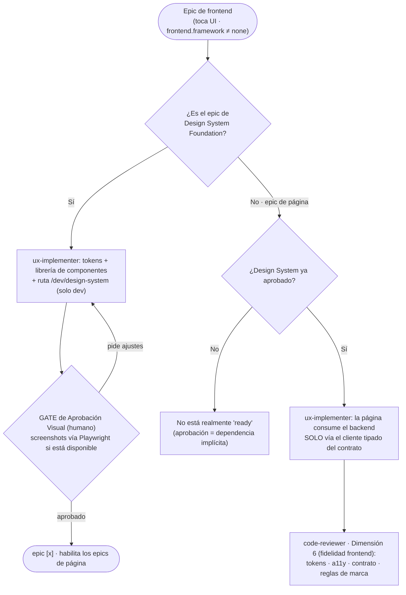

---

## 4. Flujos de fase

### 4.1 Setup — 3 modos (Bootstrap / Adopt / Reconfigure)

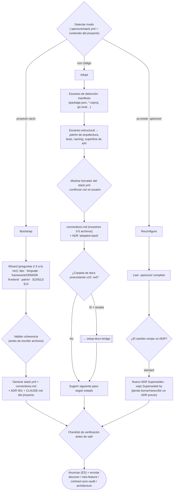

### 4.2 Discover — levantamiento socrático (sin tecnología)

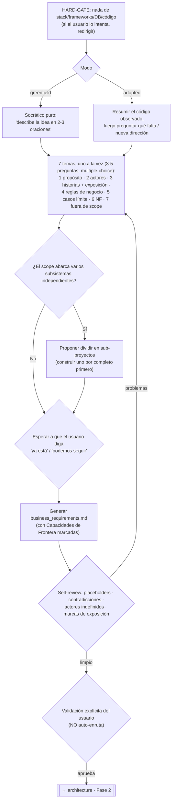

### 4.3 Architecture — arquitectura + contrato de API + ROADMAP (A/B/C)

Tres partes secuenciales, cada una con su gate. El **contrato de API** es la fuente única de verdad
backend↔frontend: nadie inventa URLs ni shapes fuera de él.

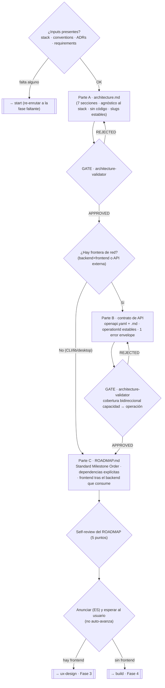

### 4.4 UX Design — 2 rutas (ambas producen los mismos 2 documentos)

La ruta solo decide **quién renderiza** el design system a código; ambas entregan `navigation_map.md`
+ `design_system.md` completo.

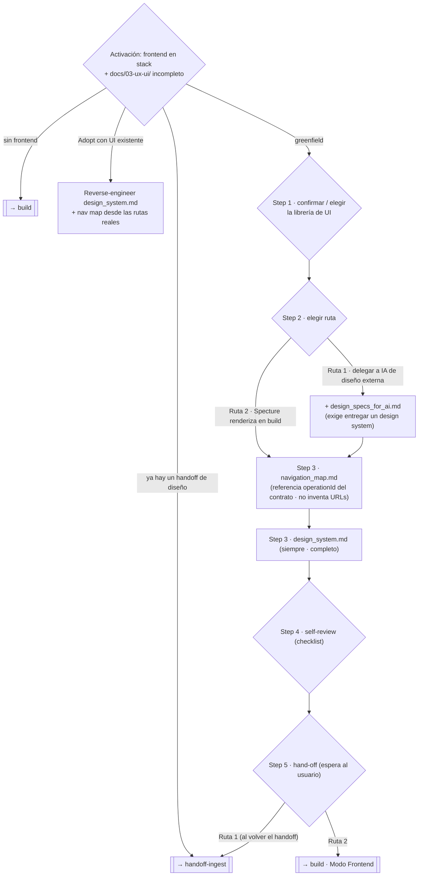

---

## 5. Flujos transversales

### 5.1 Debug — causa raíz obligatoria

Modo emergencia. Prohíbe fixes sin investigación. La hipótesis se escribe **dentro de Plan mode** —
hasta que el usuario aprueba, no se puede tocar código. Límite duro de **3 hipótesis** antes de
escalar arquitectónicamente.

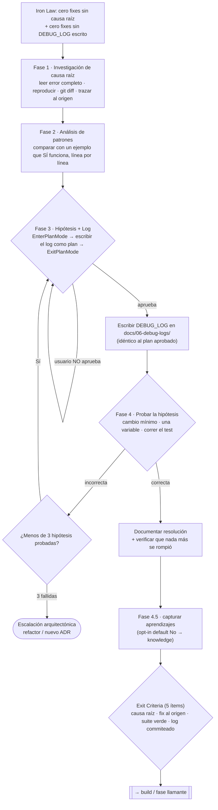

### 5.2 New-feature — Impact Ripple Analysis

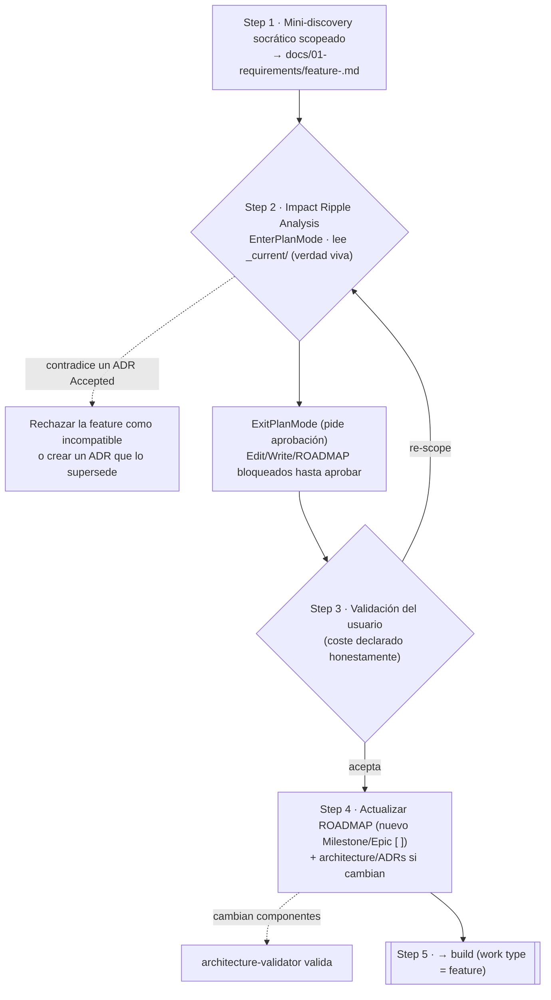

### 5.3 Verify — la función gate de 5 pasos

Gate puro (no enruta por estado). Evidencia antes que afirmaciones: ningún "completado" sin correr
el comando de verificación **en este turno** y leer su salida.

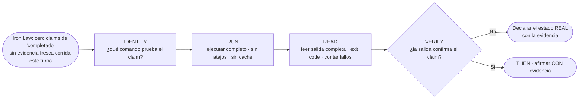

### 5.4 Modernize — migración incremental (Strangler Fig)

Cubre upgrade de versión y migración de tecnología. La ley de hierro: **tests de caracterización
antes del primer cambio de código**; nunca Big Bang; un módulo por epic.

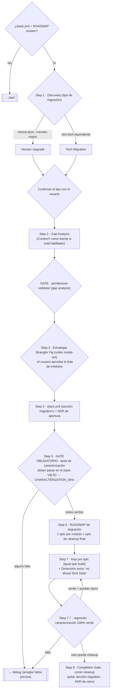

### 5.5 Knowledge — captura + auditoría (una skill, dos modos)

Higiene de conocimiento. **Nunca escribe a la memoria personal de Claude.** Captura genera drafts con
aprobación atómica vía Plan mode; auditoría es read-only y nunca auto-corrige.

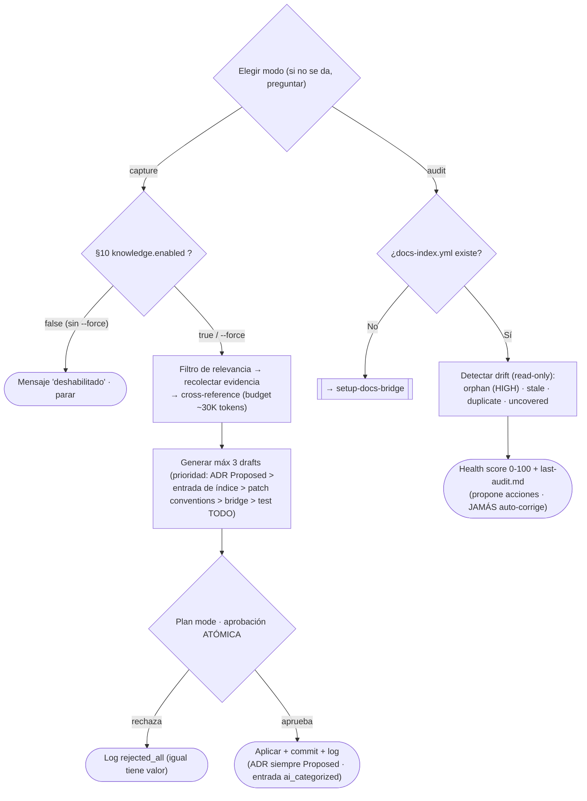

### 5.6 Handoff-ingest — convertir un handoff de diseño al stack

Cuatro HARD-GATE gobiernan todo: sin código de producción, extracción de tokens determinista, no
inventar reglas de marca, fidelidad acotada al stack (copia literal si coincide, paridad visual si no).

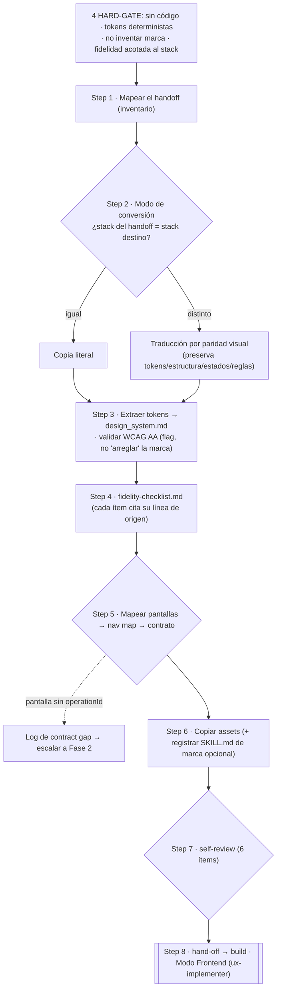

### 5.7 Contract-sync-audit — reconciliar backend ↔ frontend desincronizados

No auto-aplica: reporta y propone contra una **fuente canónica**, luego enruta el trabajo real.

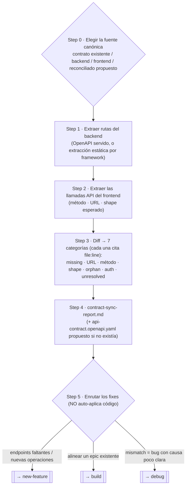

### 5.8 Setup-docs-bridge — integrar docs preexistentes sin duplicarlos

Cuatro Iron Rules: no reorganizar, no duplicar, ADRs solo `Proposed`, nada categorizado en silencio.
Genera bridges referenciales que apuntan a los originales y un índice machine-readable.

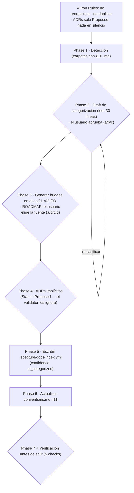

---

## Apéndice — Invariantes que atraviesan todos los flujos

- **Tres leyes de hierro:** cero código sin spec · cero fix sin causa raíz · cero "completado" sin verificar.
- **Contexto restringido:** cada agente recibe solo lo que necesita; nunca la conversación entera ni memoria personal.
- **Filesystem > memoria:** el router y todos los gates confían en los archivos en disco, no en el historial de chat.
- **El contrato de API es la fuente única de verdad** backend↔frontend desde v1.6.0 (operationId, no URLs inventadas).
- **ADRs nunca se borran:** se superseden (`Supersedes` / `Superseded by`); los auto-generados nacen `Proposed`.
- **Gates innegociables:** validación de arquitectura, RED commit, TDD Honesty Gate, code review, verificación, aprobación visual humana (UI).
