# Diagramas de Flujo de Ejecución — Specture

> Mapa visual de **todos los flujos que el framework ejecuta en tiempo real**: cómo se entra,
> cómo se enruta por estado, cómo cada fase y cada capacidad transversal corre, qué agentes de
> contexto restringido se despachan y qué gates bloquean el avance.

Los diagramas están en **Mermaid** — se renderizan automáticamente en GitHub, VS Code (con la
extensión Mermaid), Obsidian y la mayoría de visores Markdown. Si tu visor no soporta Mermaid,
cada diagrama va acompañado de prosa que describe el flujo.

## Cómo leer estos diagramas (notación)

| Forma | Significado |
|-------|-------------|
| `([texto])` (estadio) | Entrada / salida del flujo (trigger, artefacto, fin) |
| `[texto]` (rectángulo) | Paso de proceso / acción |
| `{texto}` (rombo) | **Gate** o decisión: bloquea el avance hasta resolverse |
| `[[texto]]` (subrutina) | **Enrutamiento** a otro skill (handoff) |
| Línea sólida `-->` | Flujo principal |
| Línea punteada `-.->` | Flujo condicional / de excepción / retorno |
| Etiqueta de arista `-->|"cond"|` | Condición que dispara esa transición |

**Convención de color en SVG:** un solo acento para gates/decisiones, neutro para el resto.

---

## 1. Mapa general

### 1.1 Ciclo de vida — las 5 fases + capacidades transversales

Specture lleva un proyecto **de la idea al código** en 5 fases secuenciales. El router (`start`)
decide en qué fase está el proyecto **mirando el filesystem**, no el historial de chat. Las
capacidades transversales no se enrutan por estado: se activan por **síntoma** durante cualquier fase.

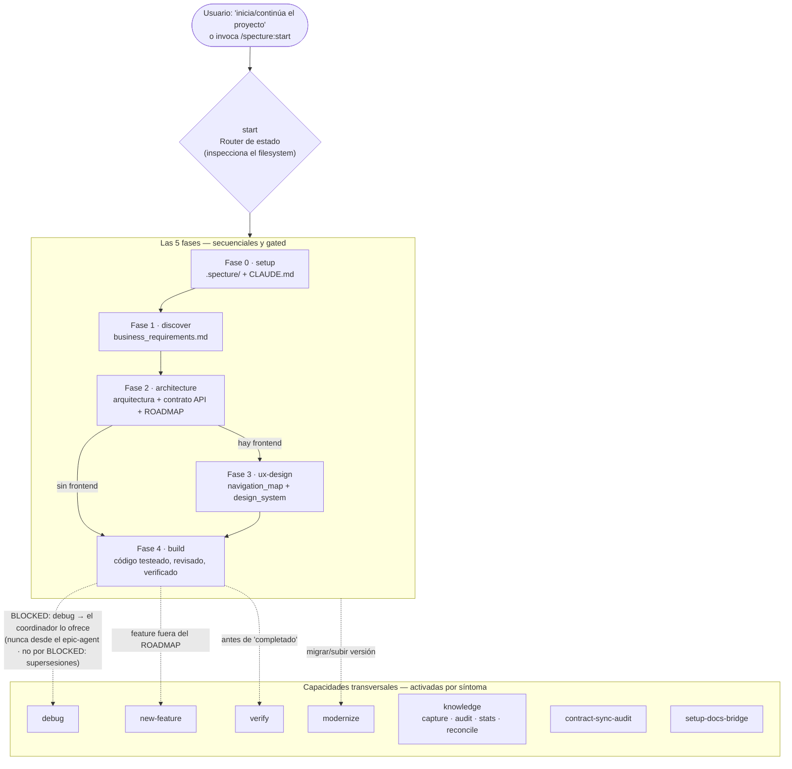
```mermaid
flowchart TB
    U(["Usuario: 'inicia/continúa el proyecto'<br/>o invoca /specture:start"]) --> R{"start<br/>Router de estado<br/>(inspecciona el filesystem)"}

    subgraph FASES["Las 5 fases — secuenciales y gated"]
      direction LR
      F0["Fase 0 · setup<br/>.specture/ + CLAUDE.md"] --> F1["Fase 1 · discover<br/>business_requirements.md"]
      F1 --> F2["Fase 2 · architecture<br/>arquitectura + contrato API + ROADMAP"]
      F2 -->|"hay frontend"| F3["Fase 3 · ux-design<br/>navigation_map + design_system"]
      F2 -->|"sin frontend"| F4
      F3 --> F4["Fase 4 · build<br/>código testeado, revisado, verificado"]
    end

    R --> FASES

    subgraph TRANS["Capacidades transversales — activadas por síntoma"]
      direction LR
      T1["debug"]
      T2["new-feature"]
      T3["verify"]
      T4["modernize"]
      T5["knowledge<br/>capture · audit · stats · reconcile"]
      T7["contract-sync-audit"]
      T8["setup-docs-bridge"]
    end

    F4 -.->|"BLOCKED: debug → el coordinador lo ofrece<br/>(nunca desde el epic-agent · no por BLOCKED: supersesiones)"| T1
    F4 -.->|"feature fuera del ROADMAP"| T2
    F4 -.->|"antes de 'completado'"| T3
    FASES -.->|"migrar/subir versión"| T4
```

### 1.2 Router de estado (`start`) — máquina de estados

El router corre un chequeo de esquema (Step 0, desde v1.15.0) y cinco chequeos de fase **en
orden**, y se detiene en el primero que falle, enrutando a la fase dueña. **Regla de costo:** nunca
lee archivos completos — usa chequeos de existencia, `grep` de una línea, la lectura de un solo
campo y una llamada al script del doctor. Confía en el filesystem por encima de la memoria.

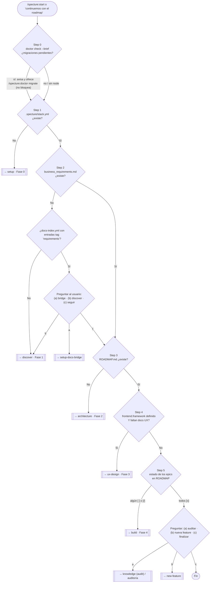
```mermaid
flowchart TD
    Start(["/specture:start o 'continuemos con el roadmap'"]) --> S0{"Step 0<br/>doctor check --brief<br/>¿migraciones pendientes?"}
    S0 -->|"sí: avisa y ofrece<br/>/specture:doctor migrate (no bloquea)"| S1
    S0 -->|"no / sin node"| S1{"Step 1<br/>.specture/stack.yml<br/>¿existe?"}
    S1 -->|No| SETUP[["→ setup · Fase 0"]]
    S1 -->|Sí| S2{"Step 2<br/>business_requirements.md<br/>¿existe?"}
    S2 -->|No| S2b{"¿docs-index.yml con<br/>entradas tag 'requirements'?"}
    S2b -->|No| DISCOVER[["→ discover · Fase 1"]]
    S2b -->|Sí| ASK1{"Preguntar al usuario:<br/>(a) bridge · (b) discover · (c) seguir"}
    ASK1 -->|a| BRIDGE[["→ setup-docs-bridge"]]
    ASK1 -->|b| DISCOVER
    ASK1 -->|c| S3
    S2 -->|Sí| S3{"Step 3<br/>ROADMAP.md ¿existe?"}
    S3 -->|No| ARCH[["→ architecture · Fase 2"]]
    S3 -->|Sí| S4{"Step 4<br/>frontend.framework definido<br/>Y faltan docs UX?"}
    S4 -->|Sí| UX[["→ ux-design · Fase 3"]]
    S4 -->|No| S5{"Step 5<br/>estado de los epics<br/>en ROADMAP"}
    S5 -->|"algún [ ] o [/]"| BUILD[["→ build · Fase 4"]]
    S5 -->|"todos [x]"| ASK2{"Preguntar: (a) auditar ·<br/>(b) nueva feature · (c) finalizar"}
    ASK2 -->|a| AUD[["→ knowledge (audit) / auditoría"]]
    ASK2 -->|b| NF[["→ new-feature"]]
    ASK2 -->|c| FIN(["Fin"])
```

---

## 2. Modelo de agentes de contexto restringido

El corazón de Specture: las fases despachan **agentes funcionales**, cada uno recibe **solo** los
archivos que necesita — nunca la conversación entera, memoria personal ni docs externos (salvo
Context7 en la Dimensión 5 del reviewer, cuando está habilitado). Esto previene el *drift* y la
alucinación acumulada. No hay "agente backend vs frontend por capa": hay **funciones cognitivas**
distintas.

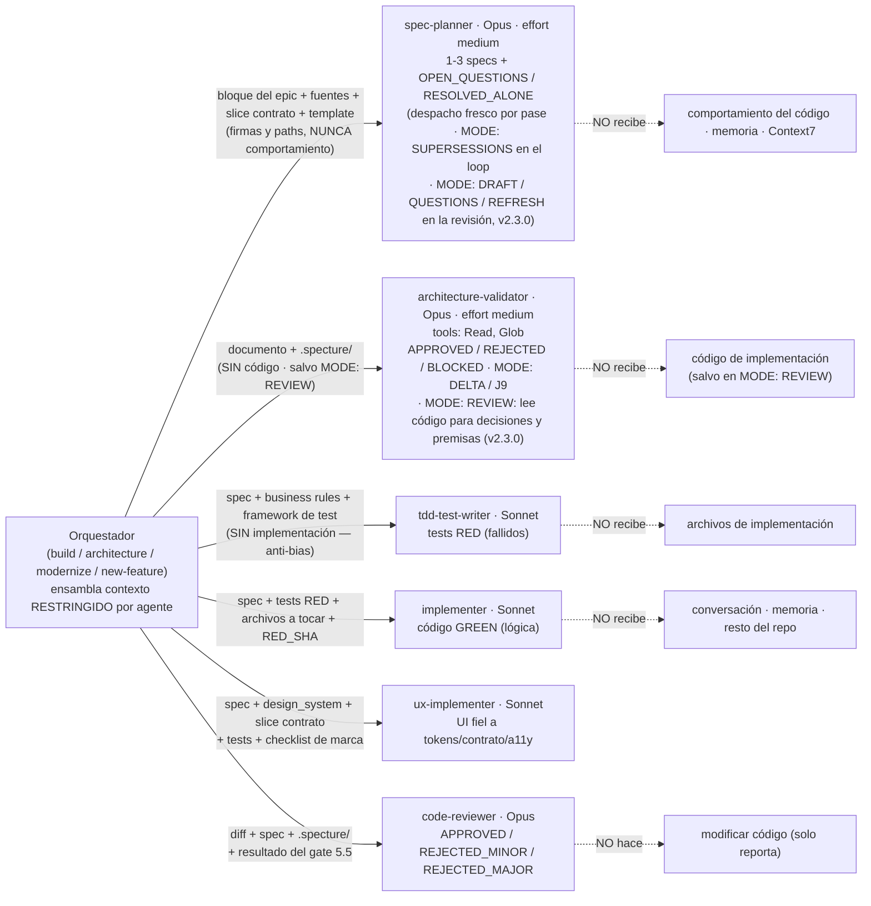
```mermaid
flowchart LR
    O["Orquestador<br/>(build / architecture / modernize / new-feature)<br/>ensambla contexto RESTRINGIDO por agente"]

    O -->|"bloque del epic + fuentes + slice contrato + template<br/>(firmas y paths, NUNCA comportamiento)"| SP["spec-planner · Opus · effort medium<br/>1-3 specs + OPEN_QUESTIONS / RESOLVED_ALONE<br/>(despacho fresco por pase · MODE: SUPERSESSIONS en el loop<br/>· MODE: DRAFT / QUESTIONS / REFRESH en la revisión, v2.3.0)"]
    O -->|"documento + .specture/<br/>(SIN código · salvo MODE: REVIEW)"| AV["architecture-validator · Opus · effort medium<br/>tools: Read, Glob<br/>APPROVED / REJECTED / BLOCKED · MODE: DELTA / J9<br/>· MODE: REVIEW: lee código para decisiones y premisas (v2.3.0)"]
    O -->|"spec + business rules + framework de test<br/>(SIN implementación — anti-bias)"| TW["tdd-test-writer · Sonnet<br/>tests RED (fallidos)"]
    O -->|"spec + tests RED + archivos a tocar + RED_SHA"| IM["implementer · Sonnet<br/>código GREEN (lógica)"]
    O -->|"spec + design_system + slice contrato<br/>+ tests + checklist de marca"| UX["ux-implementer · Sonnet<br/>UI fiel a tokens/contrato/a11y"]
    O -->|"diff + spec + .specture/<br/>+ resultado del gate 5.5"| CR["code-reviewer · Opus<br/>APPROVED / REJECTED_MINOR / REJECTED_MAJOR"]

    SP -.->|"NO recibe"| X5["comportamiento del código · memoria · Context7"]
    AV -.->|"NO recibe"| X1["código de implementación<br/>(salvo en MODE: REVIEW)"]
    TW -.->|"NO recibe"| X2["archivos de implementación"]
    IM -.->|"NO recibe"| X3["conversación · memoria · resto del repo"]
    CR -.->|"NO hace"| X4["modificar código (solo reporta)"]
```

**Verdicts comunes:** `APPROVED` · `REJECTED` / `REJECTED_MINOR` / `REJECTED_MAJOR` ·
`NEEDS_CONTEXT` (falta input → falla barata en turno 1) · `BLOCKED` (no puede avanzar).
Todos los implementadores validan el **Dispatch Manifest** como primera acción (Step 0).

---

## 3. El Build Loop — el núcleo

### 3.1 Modelo coordinador / cola secuencial

Hay **un solo** modo de ejecución. El chat es **solo coordinador**: autoriza specs únicamente vía el `spec-planner` (Spec Planning Gate) y no corre tests.
Construye una cola de hasta **N** epics y despacha **un epic-agent aislado a la vez**
(concurrencia = 1). Tests, implementación y reviews viven dentro de cada epic-agent y se
descartan al terminar; los despachos y preguntas del gate sí se acumulan en el coordinador.
**Checkpoint declarado** (v2.2.0): todo lo que importa vive en disco (ROADMAP, `_planning.md`,
sello, `.specture/state/gate/`, `build-metrics.jsonl`), así que después de cualquier epic se
puede cerrar la sesión y seguir con `/specture:start`.

**Etapa de revisión (v2.3.0, paso 4.5 de la cola).** Antes de ejecutar nada, `review.js status`
dice si un registro `CERRADA` ya cubre toda la cola; si no, el coordinador corre la revisión de
la tanda (3.7): una sentada contigo, dos rondas como mucho, y el registro en
`docs/05-specs/_reviews/`. Después, cada epic de un registro cerrado pasa por **Refresh & seal**
sin preguntas (3.8); uno que no pasó por la revisión sigue por el Spec Planning Gate (3.2). Una
decisión nueva al refrescar un epic no regulatorio lo **aparca** y la cola sigue con los que no
dependen de él.

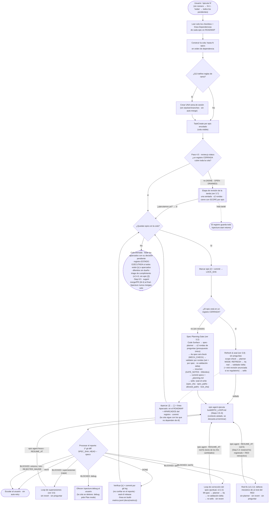
```mermaid
flowchart TD
    A(["Usuario: 'ejecuta N'<br/>(sin número → N=1 · 'todas' → todos los pendientes)"]) --> B["Leer solo los checkbox + línea Dependencias<br/>de cada epic en ROADMAP"]
    B --> C["Construir la cola: hasta N epics<br/>en orden de dependencia"]
    C --> Br{"¿§13 define reglas de rama?"}
    Br -->|Sí| Br2["Crear UNA rama de sesión<br/>(sin stacked-branches · sin auto-merge)"]
    Br -->|No| D["TaskCreate por epic encolado<br/>(cola visible)"]
    Br2 --> D
    D --> RV{"Paso 4.5 · review.js status<br/>¿un registro CERRADA cubre toda la cola?"}
    RV -->|"no (NONE · OPEN · DRAINED)"| RVS[["Etapa de revisión de la tanda (ver 3.7)<br/>una sentada · ≤2 rondas · cierre con SCOPE por epic"]]
    RVS -->|"'¿ejecutamos ya?' → sí"| L
    RVS -.->|"'más tarde'"| LATER(["El registro guarda todo<br/>/specture:start retoma"])
    RV -->|"sí"| L{"¿Quedan epics en la cola?"}
    L -->|Sí| E["Marcar epic [/] + commit → LOCK_SHA"]
    E --> RQ{"¿El epic está en un<br/>registro CERRADA?"}
    RQ -->|"sí"| RS["Refresh & seal (ver 3.8) · sin preguntas<br/>scope-check → planner MODE: REFRESH → 4a real → validador delta<br/>(+ mini-revisión anunciada si es regulatorio) → sello"]
    RS -->|"sellado"| F
    RS -.->|"decisión nueva (epic no regulatorio)"| PK["Aparcar: [/] → [ ] + línea Aparcado: en el ROADMAP<br/>+ APARCADOS del registro · commit<br/>(la cola sigue con los que no dependen de él)"]
    PK --> L
    RQ -->|"no (sin revisión)"| SPG["Spec Planning Gate (ver 3.2):<br/>Code Surface → spec-planner → ≤2 rondas de preguntas (presupuesto único)<br/>→ 4a spec-set-check (MECH_CHECK) → validator por rondas (set + por spec · re-validación delta)<br/>→ resumen (GATE_NOTES · Diferidos) → commit specs + _planning.md<br/>→ sello: seal-cli write (spec_sha · spec_paths · allowed_paths · lock_sha)"]
    SPG --> F["epic-agent ejecuta build/EPIC_LOOP.md (Steps 3.9–8)<br/>(contexto aislado, se descarta al terminar)"]
    F --> G{"Procesar el reporte:<br/>1º git diff SPEC_SHA..HEAD -- specs"}
    G -->|"diff ≠ vacío"| ESC
    G -->|DONE| H["Verificar [x] + commit por git log<br/>(no confiar en el reporte) · seal-cli release<br/>· línea en build-metrics.jsonl (docs(metrics))"]
    G -->|"BLOCKED: supersesiones (capa)"| SUP["Loop de supersesiones (ver 3.6)<br/>sin revert · sin preguntar"]
    SUP -->|"epic-agent fresco · RESUME_AT"| F
    G -->|"BLOCKED: spec"| COR["Loop de corrección del spec (puntual, v2.2.2)<br/>lift-spec → planner → 4a → re-validación delta<br/>→ re-sello · sin revert"]
    COR -->|"epic-agent · RESUME_AT: red-fix (tests de los IDs cambiados)"| F
    G -->|"BLOCKED: red-fix"| RFX["Red-fix (v2.2.2): defecto mecánico de un test del RED<br/>sin planner · sin revert · sin preguntar"]
    RFX -->|"epic-agent · RESUME_AT: red-fix<br/>(Step 5.3: test(red-fix) registrado + RED retroactivo)"| F
    G -->|"BLOCKED: debug"| DBG[["Ofrecer /specture:debug al usuario<br/>(la cola se detiene: debug pide Plan mode)"]]
    G -->|"BLOCKED: entorno / otro · REJECTED_MAJOR"| ESC(["Escalar al usuario · sin auto-retry"])
    H --> L
    L -->|No| FIN(["Cola drenada · listar los aparcados con su decisión pendiente<br/>· registro ESTADO: EJECUTADA si todos están [x] o aparcados<br/>· diferidos sin dueño · triage de cumplimiento (v2.4.0, sin epic [/])<br/>· Step 8.5 · sugerir merge/PR (W-4) al final · Specture nunca mergea solo"])
```

### 3.2 El loop por epic — `spec → validate → RED → GREEN → review → verify`

El diagrama central del framework. La planificación vive en el **coordinador** (Spec
Planning Gate: `spec-planner` + validación por rondas); los Steps 3.9–8 son el procedimiento
del epic-agent y viven en `build/EPIC_LOOP.md` (único archivo que recibe); Step 1 y Steps
8.5/8.7/9 son del coordinador (`build/SKILL.md`). Los **gates** (rombos) son innegociables:
planificación validada, RED commit, TDD Honesty Gate, code review y verificación.

Desde v2.2.0 el gate **converge**: un solo presupuesto humano (≤2 rondas de preguntas, de
cualquier origen, más una única pregunta cerrada en el tope); una **ronda** es el conjunto de
despachos del validador que salen juntos; tras un rechazo, planner fresco con `ALCANCE` y
**re-validación delta** (`MODE: DELTA`: veredicto previo + diff de TREEs y de fuentes); un
**APPROVED avanza** — sus WARNING/NOTES van a `GATE_NOTES` o a Diferidos con epic dueño, nunca
a otra pasada ni a otra pregunta; 3 rondas sin APPROVED → **una** pregunta cerrada con menú
según la clase del BLOCKER vivo. Los FAIL de 4a no cuentan para el tope. La completitud de la
lista de supersesiones ya no es criterio del gate: la ejecución la descubre (3.5 y 3.6).

```mermaid
flowchart TD
    S1["Step 1 · Pick & Lock (coordinador)<br/>epic → [/] · commit"] --> SP
    subgraph GATE ["coordinador · Spec Planning Gate"]
    CS["Pre-flights · Code Surface Resolution (SYMBOL | PATH | SIGNATURE, haiku / grep — el planner no lee código)<br/>+ Rules Resolution (rules-resolve.js --tags → RULES_RESOLVED) + docs-index + _current/"]
    CS --> SP["spec-planner · Opus · effort medium<br/>1-3 specs + COVERAGE_TABLE + OPEN_QUESTIONS / RESOLVED_ALONE<br/>(despacho fresco por pase · ALCANCE · nunca SendMessage)"]
    SP --> TR["git add + git write-tree → TREE del pase<br/>(spec tocado fuera de ALCANCE → se restaura del TREE previo)"]
    TR --> SQ{"¿OPEN_QUESTIONS?"}
    SQ -->|"sí"| ASKQ["AskUserQuestion · presupuesto ÚNICO del gate:<br/>≤2 rondas de cualquier origen · ≤4 por ronda<br/>opciones del planner tal cual (+ derivadas)<br/>respuestas → RN/ADR in place + commit → planner fresco"]
    ASKQ --> SP
    SQ -->|"no"| MC{"4a · spec-set-check.js (mecánico)<br/>C1 cobertura · C2 RN · C4 firmas · C5 sizing · C6 orden<br/>· C-sup: el test existe y su nombre aparece en el archivo"}
    MC -->|"FAIL (no cuenta para el tope)"| FIXM["planner fresco con VIOLATIONS<br/>(3 FAIL idénticos seguidos → BLOCKED: gate)"]
    FIXM --> SP
    MC -->|"PASS → MECH_CHECK token"| S3a{"GATE 5a · validator · dispatch de SET<br/>C3 dueños de Fuera de Scope · C7 citas · C8 Superficie"}
    S3a -->|REJECTED| RC{"¿3 rondas sin APPROVED?<br/>(despachos paralelos = 1 ronda)"}
    S3a -->|APPROVED| S3{"GATE 5b · validator por spec<br/>(dims 1-6, con MECH_CHECK)"}
    S3 -->|REJECTED| RC
    RC -->|"no"| FIXS["planner fresco con VIOLATIONS + ALCANCE → 4a<br/>→ re-validación DELTA: solo lo tocado · PRIOR_VERDICT + DIFF<br/>(BLOCKER nuevo solo sobre el diff o LATE, ≤1 por epic)"]
    FIXS --> SP
    RC -->|"sí"| CAPQ(["UNA pregunta cerrada · menú por clase del BLOCKER vivo<br/>ADR: enmendar | cumplir · contrato · discover | elegir regla · partir · pausar"])
    S3 -->|"APPROVED = avanza"| RT["WARNING / NOTES → GATE_NOTES · DIFERIDOS<br/>(+ Diferidos heredados en el epic dueño)<br/>nunca otra pasada ni otra pregunta"]
    RT --> SC["Resumen (specs · RESOLVED_ALONE · GATE_NOTES · Diferidos)<br/>→ commit specs + _planning.md · SPEC_SHA<br/>· seal-cli write (spec_paths + allowed_paths + lock_sha) · TaskCreate por spec"]
    end
    SC --> S39
    subgraph EL ["epic-agent · build/EPIC_LOOP.md (Steps 3.9–8 · Sonnet)"]
    S39["Step 3.9 · línea base: suite completa antes del primer RED<br/>fallos re-corridos 2× → BASELINE_FALLOS (no bloquean · se reportan)"]
    S39 --> S4
    S4["Step 4 · RED · tdd-test-writer<br/>escribe tests que FALLAN (sin ver código)<br/>(+ commit test(supersede) previo si el spec declara Supersede:)"]
    S4 --> S4c{"Post-checks: ¿fallan por la razón correcta?<br/>¿RED commit solo-tests? · capturar RED_SHA<br/>· seal-cli merge-spec (lista de archivos del RED)"}
    S4c -->|No| S4
    S4c -->|Sí| S5["Step 5 · GREEN · implementer / ux-implementer · por capas (ver 3.5)<br/>código mínimo · tests sellados · solo paths Crea:/Modifica:<br/>(re-lectura de firmas del spec anterior antes del Manifest)"]
    S5 -.->|"tests viejos que una regla del spec vuelve falsos"| SUPB(["BLOCKED: supersesiones (capa)<br/>→ loop de supersesiones del coordinador (ver 3.6)"])
    SUPB -.->|"RESUME_AT: supersede"| S52["Step 5.2 · reescritura SUPERSEDE-HEAD registrada por SHA<br/>· red-lines · RED retroactivo en LOCK_SHA"]
    S52 -->|"regresiones J9 NO o WIP de compilación"| S5
    S52 -->|"sin pendientes"| S55
    S5 --> S55{"Step 5.5 · TDD Honesty Gate (mecánico)<br/>honesty-check: clean-tree · range (allowlist de SHAs) · red-lines"}
    S55 -->|"algún FAIL ❌"| VIOL["Violación TDD →<br/>$SPECTURE_ROOT/docs/tdd-honesty-reference.md"]
    S55 -->|"3 PASS ✅"| S6{"Step 6 · GATE · code-reviewer<br/>(+ linter + type-check en paralelo)<br/>Dim 1 verifica firmas Crea: en HEAD · Dim 4 juzga cada reescritura contra su regla<br/>· Dim 7 solo con RULES_RESOLVED · CAUSE: parseable"}
    S6 -->|REJECTED_MINOR| S5
    S6 -->|REJECTED_MAJOR| ESC["Fix grande con contexto fresco<br/>o escalar al usuario"]
    S6 -.->|"3 loops sin APPROVED"| CAP["Iteration Cap → BLOCKED: spec (ID)<br/>o BLOCKED: debug (spec) — nunca invoca debug"]
    S6 -->|APPROVED| S7{"Step 7 · Verificación<br/>correr tests fresh · leer salida completa<br/>(solo los BASELINE_FALLOS no bloquean)"}
    S7 -->|"rojo"| ESC
    S7 -->|"verde"| S8["Step 8 · epic → [x] · commit<br/>· seal-cli release · reporte con METRICS + SUPERSESSIONS"]
    end
    S8 --> S85["Step 8.5 · Capturar aprendizajes (coordinador)<br/>(opt-in default No → knowledge)"]
    S85 --> S87["Step 8.7 · Reconciliación de milestone<br/>(si cierra: _current/ + revisión de cumplimiento (v2.4.0, sin preguntar)<br/>+ lápidas en ROADMAP)"]
    S87 --> S9(["Step 9 · Reset de contexto (automático)<br/>el epic-agent se descarta → siguiente epic"])
```

### 3.3 Sello del build — secuencia (tests, specs y superficie)

Tres contratos se **sellan** en `.specture/state/build-locked.json` (schema v3, escrito solo por
`hooks/lib/seal-cli.js`): los specs validados (`spec_sha` + `spec_paths`, coordinador), los
tests de cada RED commit (`specs[]`, epic-agent) y la superficie declarada por los specs
(`allowed_paths`). Un hook opcional lo bloquea mecánicamente; el coordinador y el epic-agent
siempre corren los chequeos mecánicos (`honesty-check.js` en el Step 5.5, `git diff
<SPEC_SHA>..HEAD` al procesar el reporte) como defensa en profundidad. Una supersesión
declarada (`Supersede:`) levanta el deny de test **solo** para esos paths y **solo** durante el
dispatch del tdd-test-writer — antes del RED si la declaró el gate, o en el Step 5.2 si la
descubrió la ejecución (`supersede --slug`, que rechaza un archivo del RED de un spec salvo
`--shared-with-red`). En el loop de supersesiones, `seal-cli.js lift-spec` libera **solo** el
archivo de ese spec (queda en `lifted_spec_paths` hasta el siguiente `write`); `red_sha_orig`
guarda el primer RED de cada spec y no se mueve.

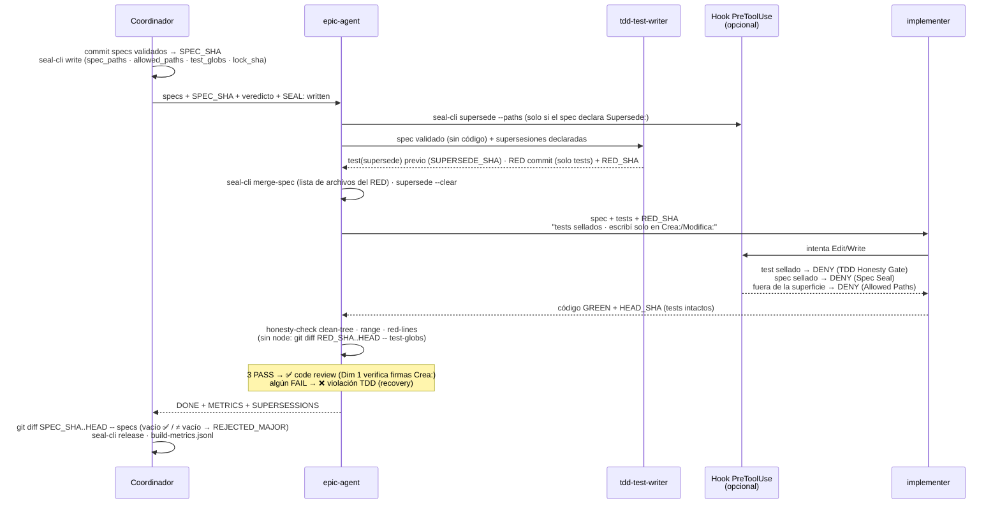
```mermaid
sequenceDiagram
    participant C as Coordinador
    participant O as epic-agent
    participant TW as tdd-test-writer
    participant H as Hook PreToolUse<br/>(opcional)
    participant IM as implementer

    C->>C: commit specs validados → SPEC_SHA<br/>seal-cli write (spec_paths · allowed_paths · test_globs · lock_sha)
    C->>O: specs + SPEC_SHA + veredicto + SEAL: written
    O->>H: seal-cli supersede --paths (solo si el spec declara Supersede:)
    O->>TW: spec validado (sin código) + supersesiones declaradas
    TW-->>O: test(supersede) previo (SUPERSEDE_SHA) · RED commit (solo tests) + RED_SHA
    O->>O: seal-cli merge-spec (lista de archivos del RED) · supersede --clear
    O->>IM: spec + tests + RED_SHA<br/>"tests sellados · escribí solo en Crea:/Modifica:"
    IM->>H: intenta Edit/Write
    H-->>IM: test sellado → DENY (TDD Honesty Gate)<br/>spec sellado → DENY (Spec Seal)<br/>fuera de la superficie → DENY (Allowed Paths)
    IM-->>O: código GREEN + HEAD_SHA (tests intactos)
    O->>O: honesty-check clean-tree · range · red-lines<br/>(sin node: git diff RED_SHA..HEAD -- test-globs)
    Note over O: 3 PASS → ✅ code review (Dim 1 verifica firmas Crea:)<br/>algún FAIL → ❌ violación TDD (recovery)
    O-->>C: DONE + METRICS + SUPERSESSIONS
    C->>C: git diff SPEC_SHA..HEAD -- specs (vacío ✅ / ≠ vacío → REJECTED_MAJOR)<br/>seal-cli release · build-metrics.jsonl
```

### 3.4 Epics de frontend — Design-System-First + Visual Approval Gate

Para UI, "los tests pasan" nunca significa "se ve bien". La lógica se testea; la **calidad visual la
aprueba un humano**, nunca Claude. El epic de design system se construye primero y pasa por un gate
de aprobación visual antes de que pueda empezar cualquier página.

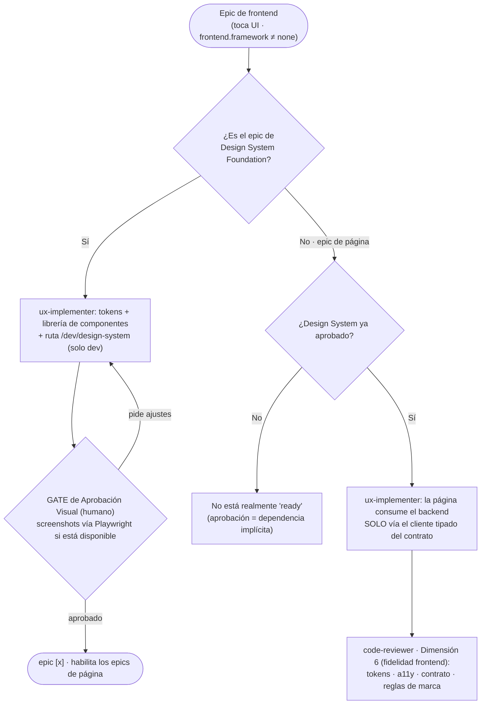
```mermaid
flowchart TD
    A(["Epic de frontend<br/>(toca UI · frontend.framework ≠ none)"]) --> B{"¿Es el epic de<br/>Design System Foundation?"}
    B -->|Sí| C["ux-implementer: tokens + librería de componentes<br/>+ ruta /dev/design-system (solo dev)"]
    C --> D{"GATE de Aprobación Visual (humano)<br/>screenshots vía Playwright si está disponible"}
    D -->|"pide ajustes"| C
    D -->|"aprobado"| E(["epic [x] · habilita los epics de página"])
    B -->|"No · epic de página"| F{"¿Design System ya aprobado?"}
    F -->|No| BLOCK["No está realmente 'ready'<br/>(aprobación = dependencia implícita)"]
    F -->|Sí| G["ux-implementer: la página consume el backend<br/>SOLO vía el cliente tipado del contrato"]
    G --> H["code-reviewer · Dimensión 6 (fidelidad frontend):<br/>tokens · a11y · contrato · reglas de marca"]
```

### 3.5 Ejecución por capas — el oráculo descubre qué tests viejos rompe el spec (v2.2.0)

El gate ya no adivina qué tests de epics cerrados rompe un spec: los descubre la ejecución
corriendo la suite, en dos capas, descontando lo que ya fallaba antes del epic
(`BASELINE_FALLOS`). El implementer **nunca** toca un test fuera de su RED ni dobla producción
contra una regla: o arregla su regresión, o cita la regla del spec que vuelve falsa la
expectativa vieja. Esta clasificación tiene precedencia sobre los disparadores de `debug`
("el mismo test falla dos veces", "el implementer reporta BLOCKED").

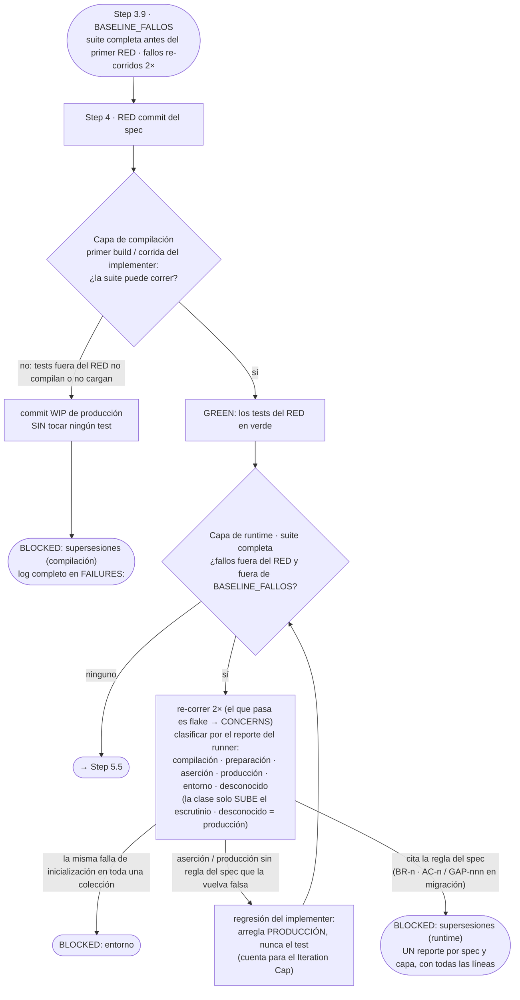
```mermaid
flowchart TD
    B(["Step 3.9 · BASELINE_FALLOS<br/>suite completa antes del primer RED · fallos re-corridos 2×"]) --> RED["Step 4 · RED commit del spec"]
    RED --> C1{"Capa de compilación<br/>primer build / corrida del implementer:<br/>¿la suite puede correr?"}
    C1 -->|"no: tests fuera del RED no compilan o no cargan"| WIP["commit WIP de producción<br/>SIN tocar ningún test"]
    WIP --> BC(["BLOCKED: supersesiones (compilación)<br/>log completo en FAILURES:"])
    C1 -->|"sí"| G["GREEN: los tests del RED en verde"]
    G --> R{"Capa de runtime · suite completa<br/>¿fallos fuera del RED y fuera de BASELINE_FALLOS?"}
    R -->|"ninguno"| OK(["→ Step 5.5"])
    R -->|"sí"| RR["re-correr 2× (el que pasa es flake → CONCERNS)<br/>clasificar por el reporte del runner:<br/>compilación · preparación · aserción · producción · entorno · desconocido<br/>(la clase solo SUBE el escrutinio · desconocido = producción)"]
    RR -->|"la misma falla de inicialización en toda una colección"| ENV(["BLOCKED: entorno"])
    RR -->|"aserción / producción sin regla del spec que la vuelva falsa"| REG["regresión del implementer:<br/>arregla PRODUCCIÓN, nunca el test<br/>(cuenta para el Iteration Cap)"]
    REG --> R
    RR -->|"cita la regla del spec<br/>(BR-n · AC-n / GAP-nnn en migración)"| BR(["BLOCKED: supersesiones (runtime)<br/>UN reporte por spec y capa, con todas las líneas"])
```

### 3.6 Loop de supersesiones — sin revert y sin preguntar (v2.2.0)

Lo corre el **coordinador** al recibir `BLOCKED: supersesiones (<capa>)`. No hay `git revert`
del RED, ni `unseal-spec`, ni pregunta al usuario: quien decide "regresión o diseño" es un
validador fresco con el dato (J9), nunca el implementer. Como mucho **un loop por spec y por
capa**; el segundo se escala. El usuario solo aparece si un test está protegido por una
invariante del proyecto. En un epic de migración J9 acepta `AC-n` / `GAP-nnn` como regla, y los
characterization tests nunca entran al loop salvo que el spec declare el `GAP-nnn` que retira
ese comportamiento.

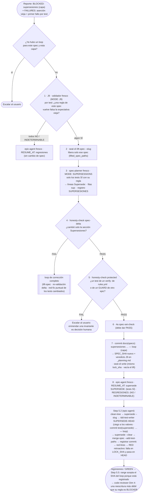
```mermaid
flowchart TD
    INR(["Reporte: BLOCKED: supersesiones (capa)<br/>+ FAILURES: aserción vieja + primer fallo por test"]) --> Q{"¿Ya hubo un loop<br/>para este spec y esta capa?"}
    Q -->|"sí"| ESC(["Escalar al usuario"])
    Q -->|"no"| J9{"1 · J9 · validador fresco (MODE: J9)<br/>por test: ¿una regla de este spec<br/>vuelve falsa la expectativa vieja?"}
    J9 -->|"todos NO / INDETERMINABLE"| RES2["epic-agent fresco · RESUME_AT: regresiones<br/>(sin cambio de spec)"]
    J9 -->|"algún SÍ"| LIFT["2 · seal-cli lift-spec --slug<br/>libera solo ese spec (lifted_spec_paths)"]
    LIFT --> PL["3 · spec-planner fresco · MODE: SUPERSESSIONS<br/>solo los tests SÍ con su regla<br/>→ líneas Supersede: · filas sup: · registro SUPERSESIONES"]
    PL --> SD{"4 · honesty-check spec-delta<br/>¿cambió solo la sección Supersesiones?"}
    SD -->|"FAIL"| COR[["loop de corrección completo<br/>(lift-spec · re-validación delta · red-fix puntual de los tests cambiados)"]]
    SD -->|"PASS"| PR{"5 · honesty-check protected<br/>¿un test de un verify: de rules.yml<br/>o de un GUARD de otro epic?"}
    PR -->|"FAIL"| ESC2(["Escalar al usuario:<br/>enmendar una invariante es decisión humana"])
    PR -->|"PASS"| MC["6 · 4a spec-set-check (debe dar PASS)"]
    MC --> CM["7 · commit docs(specs): supersesiones … — loop (capa)<br/>→ SPEC_SHA nuevo + veredicto J9 en _planning.md<br/>· seal-cli write (mismo lock_sha · vacía el lift)"]
    CM --> RES["8 · epic-agent fresco · RESUME_AT: supersede<br/>SUPERSEDE: (tests SÍ) · REGRESIONES: (NO / INDETERMINABLE)"]
    RES --> S52["Step 5.2 (epic-agent)<br/>clean-tree → supersede --slug → tdd-test-writer SUPERSEDE-HEAD<br/>(ciego a los valores · commit test(supersede): … — loop)<br/>→ supersede --clear → merge-spec --add-test-paths → registrar commit:<br/>→ red-lines → RED retroactivo: falla en LOCK_SHA y pasa en HEAD"]
    S52 --> S55(["regresiones / GREEN → Step 5.5: range acepta el SHA del loop porque está registrado<br/>→ code-reviewer Dim 4: una reescritura más débil que su regla es BLOCKER"])
```

El RED retroactivo es la prueba de que la reescritura expresa la regla: si los tests
reescritos **pasan** también en `LOCK_SHA` (el commit que marcó el epic `[/]`), no discriminan —
el test-writer se re-despacha una vez con ese dato y, a la segunda, es `BLOCKED: spec <regla>`;
si no compilan en la base, el resultado es `REVIEW` y lo juzga el reviewer. Para auditarlo a
mano: `git log --oneline <red_sha_orig>..HEAD -- <globs de test>` y cada SHA tiene que estar
en `## SUPERSESIONES` del `_planning.md` del epic (`docs/build-faq.md`).

### 3.7 Etapa de revisión por tanda — R0–R5 (v2.3.0)

La corre el **coordinador** en el paso 4.5 de la cola, con el procedimiento de
`build/REVIEW_STAGE.md` (el epic-agent nunca lo ve). Concentra en **una sentada antes de
ejecutar** —dos rondas como mucho— toda decisión que la máquina puede prever, y deja a la
ejecución una sola regla: una decisión que nadie previó aparca el epic, nunca se pregunta a
mitad de la cola (salvo la mini-revisión anunciada de un epic regulatorio, 3.8). El planner
sigue ciego al código; el que lee código es el validador en `MODE: REVIEW`, para encontrar
decisiones y verificar premisas, nunca para decidir una respuesta. **La recomendada nunca se
aplica por defecto.** Cada respuesta se escribe al momento en el registro
`docs/05-specs/_reviews/<fecha>-<slug>.md` (plantilla `templates/BATCH_REVIEW_TEMPLATE.md`), así
que una sentada cortada se retoma en su estado sin repreguntar. Guía para el usuario:
`docs/review-stage-guide.md`.

```mermaid
flowchart TD
    Q(["Paso 4.5 de la cola<br/>(ningún registro CERRADA cubre la cola)"]) --> R0{"R0 · review.js status"}
    R0 -.->|"hay un epic [/]"| WAIT(["No se abre: terminarlo<br/>o aparcarlo primero"])
    R0 -->|"NONE / DRAINED"| NEW["Abrir el registro docs/05-specs/_reviews/fecha-slug.md<br/>ESTADO: PREPARANDO · EPICS en orden de ejecución<br/>· REGULATORIOS (datos personales · salud · dinero · consentimiento legal), con su porqué"]
    R0 -->|"OPEN (sentada cortada)"| RES["Retomar en su estado · persistir lo que falte<br/>'quedan X de Y decisiones'<br/>nunca repreguntar lo que el registro ya responde"]
    R0 -->|"CLOSED"| BACK(["Volver a la cola → Refresh & seal (3.8)"])
    NEW --> CS
    RES -.->|"PREPARANDO"| CS
    RES -.->|"RONDA-1"| R2
    RES -.->|"RONDA-2"| R4
    subgraph PREP ["R1 · preparación desatendida, por epic (sin preguntas)"]
    CS["Code Surface Resolution"] --> DR["spec-planner fresco · MODE: DRAFT<br/>ciego al código · sin Superficie<br/>duda abierta → recomendada marcada 'sujeto a Q-n'"]
    DR --> DC{"spec-set-check --draft --batch<br/>DRAFT_PASS / DRAFT_FAIL · nunca habilita un sello"}
    DC -->|"DRAFT_FAIL"| MP["una micro-pasada del planner con las VIOLATIONS<br/>(si sigue fallando: nota en el registro, no bloquea)"]
    MP --> AV
    DC -->|"DRAFT_PASS"| AV["architecture-validator · MODE: REVIEW<br/>LEE CÓDIGO (Read / Glob)<br/>HUMAN_DECISIONS + PREMISAS con path:línea"]
    AV --> PR["PREMISAS → registro<br/>FALSA: VIOLATION si las fuentes deciden · pregunta si no"]
    PR --> QS["spec-planner · MODE: QUESTIONS (sin código)<br/>preguntas cerradas: 2-4 opciones · recomendada con fuente de negocio<br/>· derivadas · Dato verificado: path:línea"]
    QS --> FL["Filtro A LA VISTA: lo que una RN · ADR · contrato · rules.yml<br/>o una revisión anterior ya decide → FILTRADAS con su cita"]
    FL --> AG["Políticas P-1…P-7 + agenda POR TEMA<br/>ESTADO: RONDA-1 · commit docs(review): preparación"]
    end
    AG --> R2{"R2 · Ronda 1 contigo (una sentada)<br/>anuncio: N decisiones · T temas · M min + las filtradas ('inclúyela')<br/>AskUserQuestion por tema · ≤4 por LLAMADA, no por ronda<br/>(más de ~40 → dos sentadas · ≤3 regulatorios por sentada)"}
    R2 --> PER["Persistir al momento: registro · RN en su sitio (aclarado en revisión) · ADR nuevo<br/>la recomendada NUNCA por defecto · delegación solo explícita, ítem por ítem<br/>· 'ninguna de las opciones' → tu regla, textual · commit antes de R3"]
    PER --> R3["R3 · desatendido: planner MODE: DRAFT con ANSWERS (edición mínima)<br/>→ spec-set-check --draft --batch → validador MODE: DELTA<br/>+ MODE: REVIEW sobre lo que abrieron las respuestas"]
    R3 --> R3Q{"¿Preguntas derivadas de tus respuestas, o LATE<br/>(chocan con un ADR · una regla BLOCKER · el contrato)?<br/>¿Una HUMAN_DECISION cerrada solo por mapeo?"}
    R3Q -->|"sí"| R4["R4 · Ronda 2 · mismas reglas que R2 · ESTADO: RONDA-2<br/>no hay tercera ronda: lo que siga abierto → discover acotado<br/>o diferido explícito con dueño"]
    R3Q -->|"no"| R5
    R4 --> R5["R5 · Cierre: DECISIONES PERSISTIDAS · review.js scope-hash → SCOPE por epic<br/>resumen: decisiones · filtradas · premisas · mini-revisiones anunciadas<br/>ESTADO: CERRADA · MÉTRICAS · commit docs(review): cierre"]
    R5 --> GO{"'¿Ejecutamos ya la tanda o más tarde?'"}
    GO -->|"ya"| BACK
    GO -->|"más tarde"| LATER(["El registro guarda todo<br/>/specture:start retoma"])
```

### 3.8 Refresh & seal, mini-revisión anunciada y epics aparcados (v2.3.0)

En el turno de cada epic de un registro cerrado las decisiones ya están tomadas: el
coordinador solo convierte los borradores en specs sellables contra el código **de ese
momento** (los epics anteriores de la tanda lo cambiaron), sin preguntar. Hay dos contactos
previstos: si el bloque del epic o sus RN cambiaron desde la sentada (`scope-check` →
`CHANGED`), ese epic vuelve a una revisión corta propia; y un epic **regulatorio** tiene su
**mini-revisión anunciada** (variante B2) justo antes del sello, con el validador leyendo los
specs ya escritos contra el código. En un epic no regulatorio, una decisión nueva de dinero,
legal, datos personales, contrato o modelo **aparca** el epic; en uno regulatorio va a su
mini-revisión, y lo que esa sentada deje abierto lo aparca. Por qué B2: el experimento
"ronda 2" (`docs/milestone-decision-stage-simulation.md` §7) mostró que las decisiones que solo
aparecen con el spec escrito en detalle —qué hace cada rol en cada pantalla, datos personales
que entran por superficies públicas— no las captura ninguna de las dos rondas.

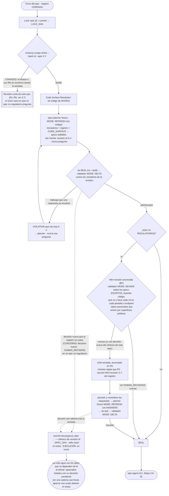
```mermaid
flowchart TD
    T(["Turno del epic · registro CERRADA"]) --> LK["Lock: epic [/] + commit → LOCK_SHA"]
    LK --> SC{"review.js scope-check --batch id --epic X.Y"}
    SC -->|"CHANGED: el bloque o sus RN se movieron desde la sentada"| SR[["Revisión corta de este epic (R1–R5, ver 3.7)<br/>el único caso en que un epic no regulatorio pregunta"]]
    SC -->|"SAME"| CS["Code Surface Resolution (el código de AHORA)"]
    CS --> RF["spec-planner fresco · MODE: REFRESH (sin código)<br/>borradores + registro + CODE_SURFACE → specs sellables<br/>cita 'fuente: revisión id A-n' · nunca pregunta"]
    RF --> MC{"4a REAL (no --draft) → validador MODE: DELTA<br/>contra los veredictos de la revisión"}
    MC -->|"hallazgo que una respuesta ya resuelve"| VA["VIOLATION que cita esa A-n<br/>→ planner · nunca una pregunta"]
    VA --> RF
    MC -.->|"decisión nueva que el registro no cubre<br/>(CONCERNS: decisión-nueva · HUMAN_DECISION)<br/>en un epic no regulatorio"| PK["APARCAR: [/] → [ ]<br/>+ línea Aparcado: fecha — clase — motivo — tanda id en el ROADMAP<br/>+ APARCADOS del registro · commit"]
    PK --> NX(["La cola sigue con los epics que no dependen de él<br/>al drenar: aparcados listados con su decisión pendiente<br/>(en una cadena casi lineal, aparcar uno suele detener el resto)"])
    MC -->|"APPROVED"| RG{"¿Epic en REGULATORIOS?"}
    RG -->|"no"| SEAL
    RG -->|"sí"| MR{"Mini-revisión anunciada (B2)<br/>validador MODE: REVIEW sobre los specs ESCRITOS, leyendo código:<br/>qué ve y hace cada rol en cada pantalla o endpoint<br/>· datos personales que entran por superficies públicas"}
    MR -->|"sin HUMAN_DECISIONS nuevas"| SEAL
    MR -->|"nuevas (o una decisión-nueva del refresco de este epic)"| MS["UNA sentada, anunciada en R5<br/>mismas reglas que R2 · sección Mini-revisión X.Y del registro"]
    MS --> MSR["persistir y commitear las respuestas → planner fresco MODE: REFRESH con ANSWERS<br/>→ 4a real → validador MODE: DELTA"]
    MSR -->|"resuelta"| SEAL
    MSR -.->|"decisión aún abierta tras la sentada"| PK["commit docs(specs): plan … — refresco de revisión id<br/>· SPEC_SHA · sello (seal-cli write) · EJECUCIÓN: en curso"]
    SEAL --> EA(["epic-agent (3.2, Steps 3.9–8)"])
```

Un epic aparcado **no es un estado nuevo**: vuelve a `[ ]` con la línea
`**Aparcado:** <ISO-8601> — <clase> — <motivo> — tanda <id>` en su bloque del ROADMAP, y la
siguiente sentada de revisión toma la decisión y borra la línea. `/specture:doctor check` lo
muestra como `epic-parked` (INFO), y como `parked-orphan` si la línea quedó en un epic `[/]` o
`[x]` o nombra una tanda sin registro.

---

## 4. Flujos de fase

### 4.1 Setup — 3 modos (Bootstrap / Adopt / Reconfigure)

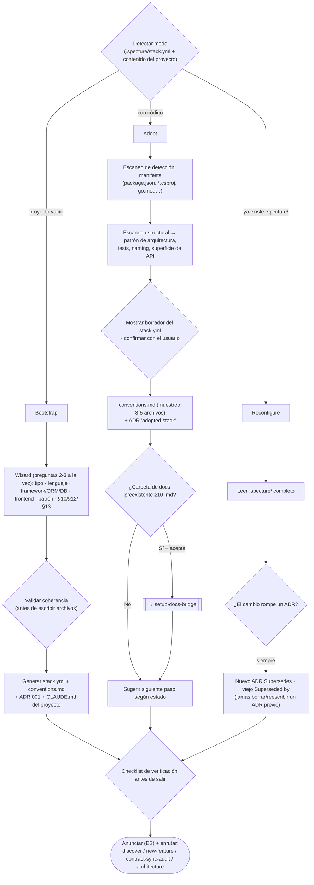
```mermaid
flowchart TD
    M{"Detectar modo<br/>(.specture/stack.yml + contenido del proyecto)"}
    M -->|"proyecto vacío"| A["Bootstrap"]
    M -->|"con código"| B["Adopt"]
    M -->|"ya existe .specture/"| C["Reconfigure"]

    A --> A2["Wizard (preguntas 2-3 a la vez): tipo · lenguaje ·<br/>framework/ORM/DB · frontend · patrón · §10/§12/§13"]
    A2 --> A3{"Validar coherencia<br/>(antes de escribir archivos)"}
    A3 --> A4["Generar stack.yml + conventions.md<br/>+ ADR 001 + CLAUDE.md del proyecto"]

    B --> B2["Escaneo de detección: manifests<br/>(package.json, *.csproj, go.mod…)"]
    B2 --> B3["Escaneo estructural → patrón de arquitectura,<br/>tests, naming, superficie de API"]
    B3 --> B5{"Mostrar borrador del stack.yml<br/>· confirmar con el usuario"}
    B5 --> B6["conventions.md (muestreo 3-5 archivos)<br/>+ ADR 'adopted-stack'"]
    B6 --> B85{"¿Carpeta de docs preexistente ≥10 .md?"}
    B85 -->|"Sí + acepta"| BR[["→ setup-docs-bridge"]]
    B85 -->|No| B9["Sugerir siguiente paso según estado"]
    BR --> B9

    C --> C2["Leer .specture/ completo"]
    C2 --> C3{"¿El cambio rompe un ADR?"}
    C3 -->|"siempre"| C4["Nuevo ADR Supersedes · viejo Superseded by<br/>(jamás borrar/reescribir un ADR previo)"]

    A4 --> V
    B9 --> V
    C4 --> V{"Checklist de verificación antes de salir"}
    V --> R(["Anunciar (ES) + enrutar:<br/>discover / new-feature / contract-sync-audit / architecture"])
```

### 4.2 Discover — levantamiento socrático (sin tecnología)

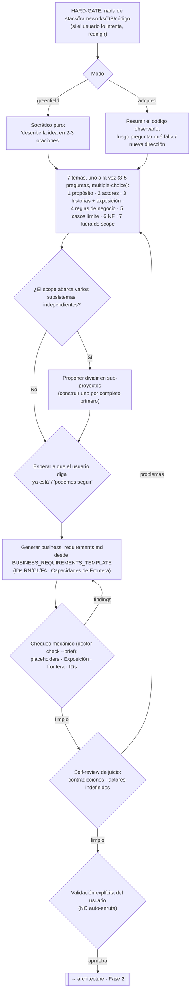
```mermaid
flowchart TD
    G["HARD-GATE: nada de stack/frameworks/DB/código<br/>(si el usuario lo intenta, redirigir)"] --> M{"Modo"}
    M -->|"greenfield"| S["Socrático puro:<br/>'describe la idea en 2-3 oraciones'"]
    M -->|"adopted"| S2["Resumir el código observado,<br/>luego preguntar qué falta / nueva dirección"]
    S --> T
    S2 --> T["7 temas, uno a la vez (3-5 preguntas, multiple-choice):<br/>1 propósito · 2 actores · 3 historias + exposición ·<br/>4 reglas de negocio · 5 casos límite · 6 NF · 7 fuera de scope"]
    T --> DC{"¿El scope abarca varios subsistemas independientes?"}
    DC -->|Sí| SPLIT["Proponer dividir en sub-proyectos<br/>(construir uno por completo primero)"]
    DC -->|No| AG{"Esperar a que el usuario diga<br/>'ya está' / 'podemos seguir'"}
    SPLIT --> AG
    AG --> D1["Generar business_requirements.md<br/>desde BUSINESS_REQUIREMENTS_TEMPLATE<br/>(IDs RN/CL/FA · Capacidades de Frontera)"]
    D1 --> D2{"Chequeo mecánico (doctor check --brief):<br/>placeholders · Exposición · frontera · IDs"}
    D2 -->|"findings"| D1
    D2 -->|"limpio"| D2b{"Self-review de juicio:<br/>contradicciones · actores indefinidos"}
    D2b -->|"problemas"| T
    D2b -->|"limpio"| D3{"Validación explícita del usuario<br/>(NO auto-enruta)"}
    D3 -->|"aprueba"| ARCH[["→ architecture · Fase 2"]]
```

### 4.3 Architecture — arquitectura + contrato de API + ROADMAP (A/B/C)

Tres partes secuenciales, cada una con su gate. El **contrato de API** es la fuente única de verdad
backend↔frontend: nadie inventa URLs ni shapes fuera de él.

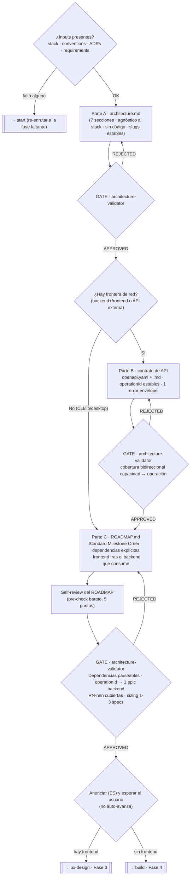
```mermaid
flowchart TD
    I{"¿Inputs presentes?<br/>stack · conventions · ADRs · requirements"}
    I -->|"falta alguno"| RB[["→ start (re-enrutar a la fase faltante)"]]
    I -->|"OK"| A["Parte A · architecture.md<br/>(7 secciones · agnóstico al stack · sin código · slugs estables)"]
    A --> GA{"GATE · architecture-validator"}
    GA -->|REJECTED| A
    GA -->|APPROVED| BW{"¿Hay frontera de red?<br/>(backend+frontend o API externa)"}
    BW -->|"No (CLI/lib/desktop)"| Croad
    BW -->|Sí| Bc["Parte B · contrato de API<br/>openapi.yaml + .md · operationId estables · 1 error envelope"]
    Bc --> GB{"GATE · architecture-validator<br/>cobertura bidireccional capacidad ↔ operación"}
    GB -->|REJECTED| Bc
    GB -->|APPROVED| Croad["Parte C · ROADMAP.md<br/>Standard Milestone Order · dependencias explícitas<br/>· frontend tras el backend que consume"]
    Croad --> SR["Self-review del ROADMAP<br/>(pre-check barato, 5 puntos)"]
    SR --> GC{"GATE · architecture-validator<br/>Dependencias parseables · operationId → 1 epic backend<br/>RN-nnn cubiertas · sizing 1-3 specs"}
    GC -->|REJECTED| Croad
    GC -->|APPROVED| W{"Anunciar (ES) y esperar al usuario<br/>(no auto-avanza)"}
    W -->|"hay frontend"| UX[["→ ux-design · Fase 3"]]
    W -->|"sin frontend"| BLD[["→ build · Fase 4"]]
```

### 4.4 UX Design — 2 rutas (ambas producen los mismos 2 documentos)

La ruta solo decide **quién renderiza** el design system a código; ambas entregan `navigation_map.md`
+ `design_system.md` completo.

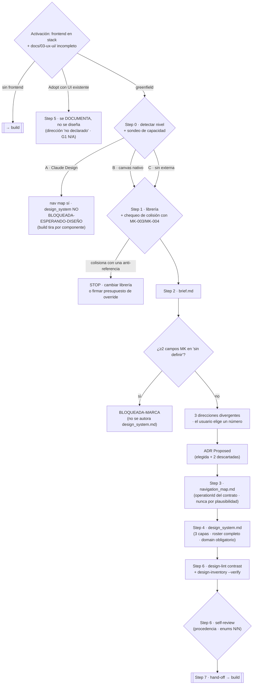
```mermaid
flowchart TD
    AC{"Activación: frontend en stack<br/>+ docs/03-ux-ui/ incompleto"}
    AC -->|"sin frontend"| BLD[["→ build"]]
    AC -->|"Adopt con UI existente"| RE["Step 5 · se DOCUMENTA, no se diseña<br/>(dirección 'no declarado' · G1 N/A)"]
    AC -->|"greenfield"| N{"Step 0 · detectar nivel<br/>+ sondeo de capacidad"}
    N -->|"A · Claude Design"| EXT["nav map sí · design_system NO<br/>BLOQUEADA-ESPERANDO-DISEÑO<br/>(build tira por componente)"]
    N -->|"B · canvas nativo"| L
    N -->|"C · sin externa"| L{"Step 1 · librería<br/>+ chequeo de colisión con MK-003/MK-004"}
    L -->|"colisiona con una anti-referencia"| STOP["STOP · cambiar librería<br/>o firmar presupuesto de override"]
    L --> BR["Step 2 · brief.md"]
    BR --> MK{"¿≥2 campos MK en 'sin definir'?"}
    MK -->|"sí"| BLK["BLOQUEADA-MARCA<br/>(no se autora design_system.md)"]
    MK -->|"no"| D3["3 direcciones divergentes<br/>· el usuario elige un número"]
    D3 --> ADR["ADR Proposed<br/>(elegida + 2 descartadas)"]
    ADR --> NAV["Step 3 · navigation_map.md<br/>(operationId del contrato · nunca por plausibilidad)"]
    NAV --> DS["Step 4 · design_system.md<br/>(3 capas · roster completo · domain obligatorio)"]
    DS --> CK["Step 6 · design-lint contrast<br/>+ design-inventory --verify"]
    CK --> SR{"Step 6 · self-review<br/>(procedencia · enums N/N)"}
    SR --> HO[["Step 7 · hand-off → build"]]
```

---

## 5. Flujos transversales

### 5.1 Debug — causa raíz obligatoria

Modo emergencia. Prohíbe fixes sin investigación. La hipótesis se escribe **dentro de Plan mode** —
hasta que el usuario aprueba, no se puede tocar código. Límite duro de **3 hipótesis** antes de
escalar arquitectónicamente.

**Excepciones dentro de `build` (v2.2.0).** El epic-agent **nunca** invoca `debug`: Plan mode
dejaría la cola esperando una aprobación que nadie puede dar. Al llegar al Iteration Cap reporta
`BLOCKED: debug <spec>`, la cola se detiene y el coordinador le ofrece `/specture:debug` al
usuario. Y un `BLOCKED: supersesiones` del implementer no dispara `debug` aunque el mismo test
haya fallado dos veces: ya está clasificado y va al loop de supersesiones (3.5 y 3.6).

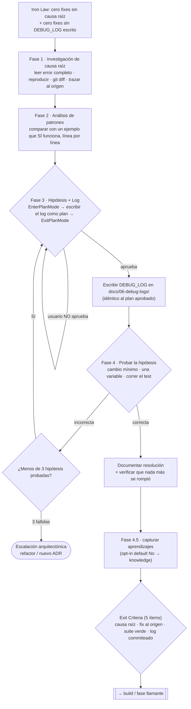
```mermaid
flowchart TD
    L["Iron Law: cero fixes sin causa raíz<br/>+ cero fixes sin DEBUG_LOG escrito"] --> P1["Fase 1 · Investigación de causa raíz<br/>leer error completo · reproducir · git diff · trazar al origen"]
    P1 --> P2["Fase 2 · Análisis de patrones<br/>comparar con un ejemplo que SÍ funciona, línea por línea"]
    P2 --> P3{"Fase 3 · Hipótesis + Log<br/>EnterPlanMode → escribir el log como plan → ExitPlanMode"}
    P3 -->|"usuario NO aprueba"| P3
    P3 -->|"aprueba"| WRITE["Escribir DEBUG_LOG en docs/06-debug-logs/<br/>(idéntico al plan aprobado)"]
    WRITE --> P4{"Fase 4 · Probar la hipótesis<br/>cambio mínimo · una variable · correr el test"}
    P4 -->|"correcta"| OK["Documentar resolución<br/>+ verificar que nada más se rompió"]
    P4 -->|"incorrecta"| H{"¿Menos de 3 hipótesis probadas?"}
    H -->|Sí| P3
    H -->|"3 fallidas"| ESC(["Escalación arquitectónica<br/>refactor / nuevo ADR"])
    OK --> P45["Fase 4.5 · capturar aprendizajes<br/>(opt-in default No → knowledge)"]
    P45 --> EX{"Exit Criteria (5 ítems)<br/>causa raíz · fix al origen · suite verde · log commiteado"}
    EX --> RET[["→ build / fase llamante"]]
```

### 5.2 New-feature — Impact Ripple Analysis

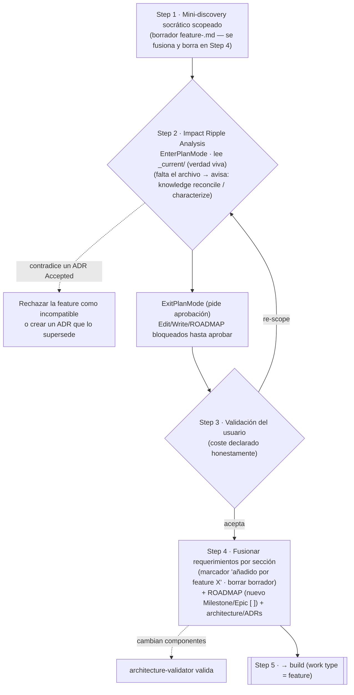
```mermaid
flowchart TD
    S1["Step 1 · Mini-discovery socrático scopeado<br/>(borrador feature-<slug>.md — se fusiona y borra en Step 4)"] --> S2{"Step 2 · Impact Ripple Analysis<br/>EnterPlanMode · lee _current/ (verdad viva)<br/>(falta el archivo → avisa: knowledge reconcile / characterize)"}
    S2 -.->|"contradice un ADR Accepted"| ADR["Rechazar la feature como incompatible<br/>o crear un ADR que lo supersede"]
    S2 --> EX["ExitPlanMode (pide aprobación)<br/>Edit/Write/ROADMAP bloqueados hasta aprobar"]
    EX --> S3{"Step 3 · Validación del usuario<br/>(coste declarado honestamente)"}
    S3 -->|"re-scope"| S2
    S3 -->|"acepta"| S4["Step 4 · Fusionar requerimientos por sección<br/>(marcador 'añadido por feature X' · borrar borrador)<br/>+ ROADMAP (nuevo Milestone/Epic [ ]) + architecture/ADRs"]
    S4 -.->|"cambian componentes"| AV["architecture-validator valida"]
    S4 --> S5[["Step 5 · → build (work type = feature)"]]
```

### 5.3 Verify — la función gate de 5 pasos

Gate puro (no enruta por estado). Evidencia antes que afirmaciones: ningún "completado" sin correr
el comando de verificación **en este turno** y leer su salida.

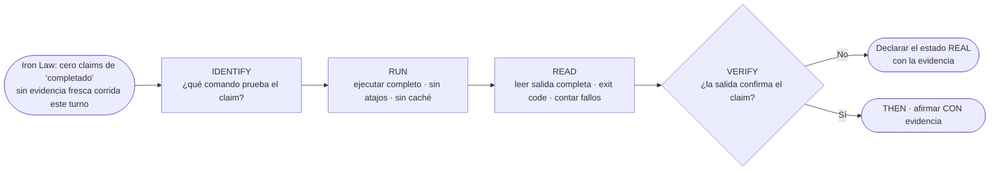
```mermaid
flowchart LR
    L(["Iron Law: cero claims de 'completado'<br/>sin evidencia fresca corrida este turno"]) --> G1["IDENTIFY<br/>¿qué comando prueba el claim?"]
    G1 --> G2["RUN<br/>ejecutar completo · sin atajos · sin caché"]
    G2 --> G3["READ<br/>leer salida completa · exit code · contar fallos"]
    G3 --> G4{"VERIFY<br/>¿la salida confirma el claim?"}
    G4 -->|No| AC(["Declarar el estado REAL<br/>con la evidencia"])
    G4 -->|Sí| G5(["THEN · afirmar CON evidencia"])
```

### 5.4 Modernize — migración incremental (Strangler Fig)

Cubre upgrade de versión y migración de tecnología. La ley de hierro: **tests de caracterización
antes del primer cambio de código**; nunca Big Bang; un módulo por epic. Los characterization
tests nunca entran al loop de supersesiones del build (3.6) salvo que el spec declare el
`GAP-nnn` que retira ese comportamiento; dentro de un epic-agent, "→ debug" significa reportar
`BLOCKED: debug <spec>` (v2.2.0).

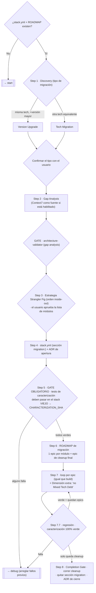
```mermaid
flowchart TD
    AC{"¿stack.yml + ROADMAP existen?"}
    AC -->|No| RB[["→ start"]]
    AC -->|Sí| S1{"Step 1 · Discovery (tipo de migración)"}
    S1 -->|"misma tech, +versión mayor"| UP["Version Upgrade"]
    S1 -->|"otra tech equivalente"| MG["Tech Migration"]
    UP --> S1b{"Confirmar el tipo con el usuario"}
    MG --> S1b
    S1b --> S2["Step 2 · Gap Analysis<br/>(Context7 como fuente si está habilitado)"]
    S2 --> G2{"GATE · architecture-validator (gap analysis)"}
    G2 --> S3{"Step 3 · Estrategia Strangler Fig (orden inside-out)<br/>· el usuario aprueba la lista de módulos"}
    S3 --> S4["Step 4 · stack.yml (sección migration:) + ADR de apertura"]
    S4 --> S5{"Step 5 · GATE OBLIGATORIO · tests de caracterización<br/>deben pasar en el stack VIEJO → CHARACTERIZATION_SHA"}
    S5 -->|"alguno falla"| DBG[["→ debug (arreglar fallos previos)"]]
    S5 -->|"todos verdes"| S6["Step 6 · ROADMAP de migración<br/>1 epic por módulo + epic de cleanup final"]
    S6 --> S7["Step 7 · loop por epic (igual que build)<br/>+ Dimensión extra: 'no Mixed Tech Debt'"]
    S7 --> RG{"Step 7.7 · regresión · caracterización 100% verde"}
    RG -->|"falla"| DBG
    RG -->|"verde + quedan epics"| S7
    RG -->|"solo queda cleanup"| S8["Step 8 · Completion Gate · correr cleanup<br/>· quitar sección migration: · ADR de cierre"]
```

### 5.5 Knowledge — captura + auditoría + stats + reconcile (una skill, cuatro modos)

Higiene de conocimiento. **Nunca escribe a la memoria personal de Claude.** Captura genera drafts con
aprobación atómica vía Plan mode; auditoría y stats son read-only y nunca auto-corrigen; reconcile
escribe un solo archivo (`_current/<slug>.md`) con aprobación en Plan mode.

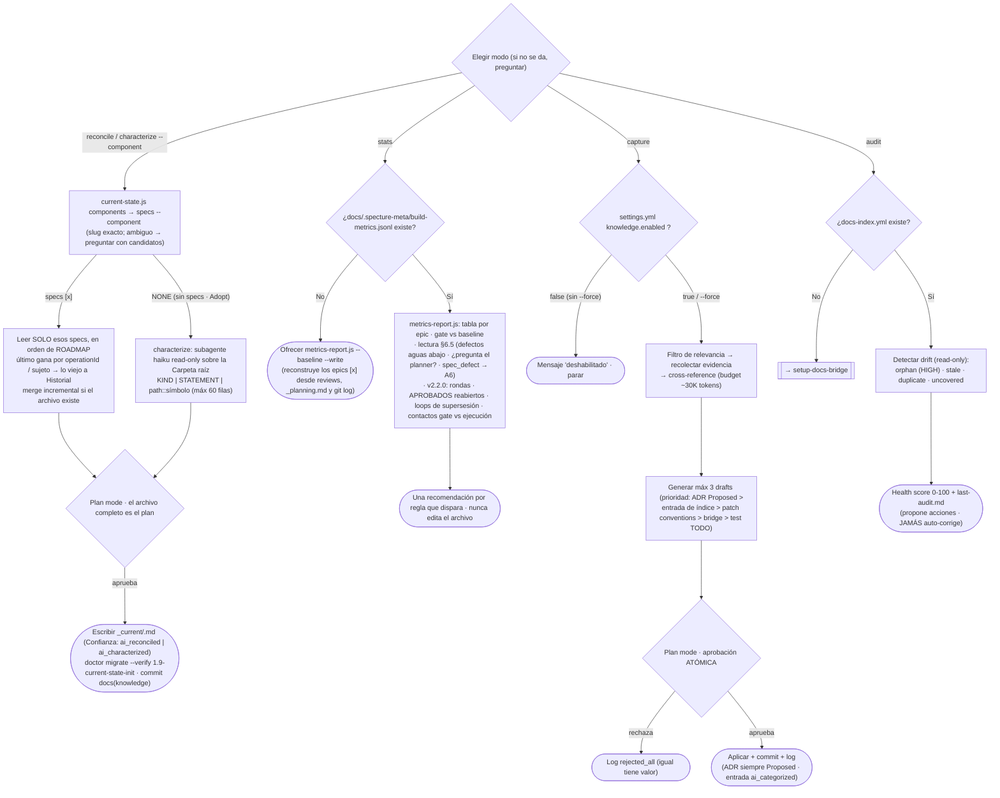
```mermaid
flowchart TD
    M{"Elegir modo (si no se da, preguntar)"}

    M -->|"reconcile / characterize --component"| R0["current-state.js components → specs --component <slug><br/>(slug exacto; ambiguo → preguntar con candidatos)"]
    R0 -->|"specs [x]"| R1["Leer SOLO esos specs, en orden de ROADMAP<br/>último gana por operationId / sujeto → lo viejo a Historial<br/>merge incremental si el archivo existe"]
    R0 -->|"NONE (sin specs · Adopt)"| R2["characterize: subagente haiku read-only sobre la Carpeta raíz<br/>KIND | STATEMENT | path::símbolo (máx 60 filas)"]
    R1 --> R3{"Plan mode · el archivo completo es el plan"}
    R2 --> R3
    R3 -->|"aprueba"| R4(["Escribir _current/<slug>.md (Confianza: ai_reconciled | ai_characterized)<br/>doctor migrate --verify 1.9-current-state-init · commit docs(knowledge)"])

    M -->|"stats"| ST0{"¿docs/.specture-meta/build-metrics.jsonl existe?"}
    ST0 -->|No| ST1(["Ofrecer metrics-report.js --baseline --write<br/>(reconstruye los epics [x] desde reviews, _planning.md y git log)"])
    ST0 -->|Sí| ST2["metrics-report.js: tabla por epic · gate vs baseline<br/>· lectura §6.5 (defectos aguas abajo · ¿pregunta el planner? · spec_defect → A6)<br/>· v2.2.0: rondas · APROBADOS reabiertos · loops de supersesión · contactos gate vs ejecución"]
    ST2 --> ST3(["Una recomendación por regla que dispara · nunca edita el archivo"])

    M -->|"capture"| C0{"settings.yml knowledge.enabled ?"}
    C0 -->|"false (sin --force)"| STOP1(["Mensaje 'deshabilitado' · parar"])
    C0 -->|"true / --force"| C1["Filtro de relevancia → recolectar evidencia<br/>→ cross-reference (budget ~30K tokens)"]
    C1 --> C3["Generar máx 3 drafts (prioridad: ADR Proposed ><br/>entrada de índice > patch conventions > bridge > test TODO)"]
    C3 --> C4{"Plan mode · aprobación ATÓMICA"}
    C4 -->|"rechaza"| LOG(["Log rejected_all (igual tiene valor)"])
    C4 -->|"aprueba"| C5(["Aplicar + commit + log<br/>(ADR siempre Proposed · entrada ai_categorized)"])

    M -->|"audit"| A0{"¿docs-index.yml existe?"}
    A0 -->|No| BRG[["→ setup-docs-bridge"]]
    A0 -->|Sí| A2["Detectar drift (read-only):<br/>orphan (HIGH) · stale · duplicate · uncovered"]
    A2 --> A4(["Health score 0-100 + last-audit.md<br/>(propone acciones · JAMÁS auto-corrige)"])
```

### 5.6 Contract-sync-audit — reconciliar backend ↔ frontend desincronizados

No auto-aplica: reporta y propone contra una **fuente canónica**, luego enruta el trabajo real.

```mermaid
flowchart TD
    S0{"Step 0 · Elegir la fuente canónica<br/>contrato existente / backend / frontend / reconciliado propuesto"}
    S0 --> S1["Step 1 · Extraer rutas del backend<br/>(OpenAPI servido, o extracción estática por framework)"]
    S1 --> S2["Step 2 · Extraer las llamadas API del frontend<br/>(método · URL · shape esperado)"]
    S2 --> S3["Step 3 · Diff → 7 categorías (cada una cita file:line):<br/>missing · URL · método · shape · orphan · auth · unresolved"]
    S3 --> S4["Step 4 · contract-sync-report.md<br/>(+ api-contract.openapi.yaml propuesto si no existía)"]
    S4 --> S5{"Step 5 · Enrutar los fixes (NO auto-aplica código)"}
    S5 -->|"endpoints faltantes / nuevas operaciones"| NF[["→ new-feature"]]
    S5 -->|"alinear un epic existente"| BLD[["→ build"]]
    S5 -->|"mismatch = bug con causa poco clara"| DBG[["→ debug"]]
```

### 5.7 Setup-docs-bridge — integrar docs preexistentes sin duplicarlos

Cuatro Iron Rules: no reorganizar, no duplicar, ADRs solo `Proposed`, nada categorizado en silencio.
Genera bridges referenciales que apuntan a los originales y un índice machine-readable.

```mermaid
flowchart TD
    IR["4 Iron Rules: no reorganizar · no duplicar<br/>· ADRs solo Proposed · nada en silencio"] --> P1["Phase 1 · Detección (carpetas con ≥10 .md)"]
    P1 --> P2{"Phase 2 · Draft de categorización (leer 30 líneas)<br/>· el usuario aprueba (a/b/c)"}
    P2 -->|"reclasificar"| P2
    P2 --> P3{"Phase 3 · Generar bridges en docs/01-/02-/03-<br/>· ROADMAP: el usuario elige la fuente (a/b/c/d)"}
    P3 --> P4{"Phase 4 · ADRs implícitos<br/>(Status: Proposed — el validator los ignora)"}
    P4 --> P5["Phase 5 · Escribir .specture/docs-index.yml<br/>(confidence: ai_categorized)"]
    P5 --> P6["Phase 6 · Actualizar conventions.md §11"]
    P6 --> P7{"Phase 7 + Verificación antes de salir (5 checks)"}
```

### 5.8 Compliance-review — un milestone contra todas las reglas (v2.4.0)

Dos modos: `milestone <N>` (desatendido; lo llama `build` en Step 8.7) y `triage` (contigo, al
vaciarse la cola). Nunca publica fuera del repositorio. Guía: `docs/compliance-review-guide.md`.

```mermaid
flowchart TD
    M0{"milestone N · compliance_review.enabled?"} -->|"false (llamado por build)"| OFF(["una línea · no corre"])
    M0 -->|"sí / a pedido"| R["compliance.js range<br/>ventanas LOCK..CLOSE por epic · bloques por componente"]
    R -->|UNVERIFIABLE| STUB["compliance.js stub → reporte BLOCKED"]
    R -->|READY| C["por bloque: RULES_RESOLVED --all + CUSTOM_RULES (--paths-file)<br/>→ compliance-reviewer MODE: REVIEW → una parte<br/>· git status sin cambios en archivos con seguimiento"]
    C --> LINT{"compliance.js lint<br/>(gramática · comentarios sin vocabulario interno)"}
    LINT -->|"FAIL (2ª vez)"| STUB
    LINT -->|"FAIL (1ª)"| C
    LINT -->|PASS| AS["compliance.js assemble → docs/07-reviews/cumplimiento-milestone-N-fecha.md<br/>· commit docs(cumplimiento)"]
    AS -->|"desde build"| BACK(["una línea informativa · la cola sigue"])
    AS -->|"a pedido"| T
    T{"triage · ¿algún epic [/]?"} -->|sí| PEND(["queda PENDIENTE para el próximo vaciado"])
    T -->|no| Q["tabla de hallazgos + propuesta<br/>· UNA pregunta cerrada: propuesta · uno por uno · diferir todo · no aplica"]
    Q --> TS["compliance.js triage --set<br/>(corregir solo si Tipo: refactor)"]
    TS -->|"hay 'corregir'"| FIX["agente de corrección (CORRECTION_LOOP.md)<br/>clean-tree · baseline · implementer MODE: CUMPLIMIENTO por hallazgo<br/>· fix-range · suite = baseline · compliance-reviewer MODE: VERIFY"]
    FIX --> CO["compliance.js correction --set"]
    TS --> DEF["diferidos (dueño: sin epic) → ofrecidos una vez como new-feature"]
    CO --> REC["compliance.js record → línea kind: compliance en build-metrics.jsonl"]
    DEF --> REC
    PRM{"pr número|url · rama (v2.5.0)"} --> PRR["compliance.js range --pr | --branch<br/>pr.js: gh pr view · az repos pr show (solo lectura) · git fetch a refs/specture/pr/<br/>copia la cabeza (head/) y las reglas de la rama DESTINO (base/)"]
    PRR -->|UNVERIFIABLE| PRE(["mensaje con el arreglo: gh auth login · az login · extensión azure-devops"])
    PRR -->|READY| PRC["por bloque: resolvers sobre base/ · CONTEXT pr|rama · FILES_ROOT head/<br/>· BRANCH / BASE_BRANCH (W-1/W-2/W-4)"]
    PRC --> PRA["lint · assemble → cumplimiento-pr-gh|pr-az|rama-…md<br/>TRIAGE NO REQUERIDO · sin commit · nada publicado"]
```

---

## Apéndice — Invariantes que atraviesan todos los flujos

- **Tres leyes de hierro:** cero código sin spec · cero fix sin causa raíz · cero "completado" sin verificar.
- **Contexto restringido:** cada agente recibe solo lo que necesita; nunca la conversación entera ni memoria personal.
- **Filesystem > memoria:** el router y todos los gates confían en los archivos en disco, no en el historial de chat.
- **El contrato de API es la fuente única de verdad** backend↔frontend desde v1.6.0 (operationId, no URLs inventadas).
- **ADRs nunca se borran:** se superseden (`Supersedes` / `Superseded by`); los auto-generados nacen `Proposed`.
- **Gates innegociables:** validación de arquitectura, RED commit, TDD Honesty Gate, code review, verificación, aprobación visual humana (UI).
